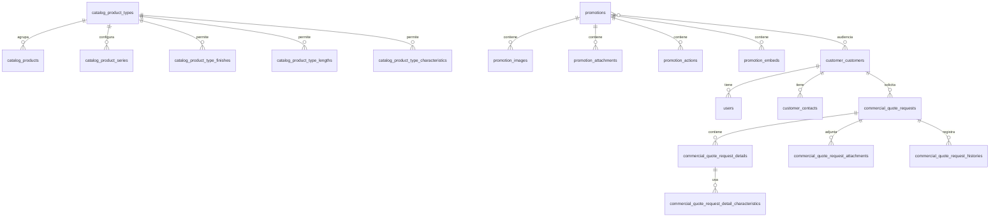

# Base de datos del sistema

Este documento describe las tablas definidas por las migraciones del backend.
Incluye las tablas de negocio, autenticacion, permisos, colas y notificaciones.

> La estructura se documenta a partir de `database/migrations`. Si una tabla se
> modifica mediante una migracion futura, este documento debe actualizarse.

## Convenciones

- `id`: clave primaria autoincremental `BIGINT`, salvo que se indique otro tipo.
- `uuid`: identificador UUID.
- `timestamps`: `created_at` y `updated_at`.
- `nullable`: la columna acepta `NULL`.
- Las claves foraneas normalmente eliminan en cascada, restringen o dejan el
  valor en `NULL` segun se indica en cada tabla.

## Diagrama general

## Tablas de clientes y usuarios

### `customer_customers`

Empresas o clientes registrados.

| Columna | Tipo | Reglas |
|---|---|---|
| `id` | BIGINT | PK |
| `company_name` | VARCHAR | Unico |
| `tax_number` | VARCHAR | Unico |
| `trade_name` | VARCHAR | Obligatorio |
| `email` | VARCHAR | Obligatorio |
| `phone` | VARCHAR | Obligatorio |
| `address` | VARCHAR | Obligatorio |
| `department` | VARCHAR | Obligatorio |
| `province` | VARCHAR | Obligatorio |
| `district` | VARCHAR | Obligatorio |
| `is_active` | BOOLEAN | Default `true` |
| `created_at`, `updated_at` | TIMESTAMP | Timestamps |

### `users`

Usuarios autenticados del sistema. El ID es UUID porque Passport y las
notificaciones privadas trabajan con identificadores UUID.

| Columna | Tipo | Reglas |
|---|---|---|
| `id` | UUID | PK |
| `customer_id` | BIGINT | FK a `customer_customers`, nullable, null al eliminar |
| `name` | VARCHAR | Obligatorio |
| `email` | VARCHAR | Unico |
| `phone` | VARCHAR(20) | Nullable |
| `is_active` | BOOLEAN | Default `true` |
| `last_login_at` | DATETIME | Nullable |
| `email_verified_at` | TIMESTAMP | Nullable |
| `password` | VARCHAR | Obligatorio |
| `remember_token` | VARCHAR(100) | Nullable |
| `created_at`, `updated_at` | TIMESTAMP | Timestamps |

### `customer_contacts`

Contactos asociados a una empresa.

| Columna | Tipo | Reglas |
|---|---|---|
| `id` | BIGINT | PK |
| `customer_id` | BIGINT | FK a `customer_customers`, cascade |
| `name`, `position`, `email`, `phone` | VARCHAR | Nullable |
| `is_primary` | BOOLEAN | Default `true` |
| `is_active` | BOOLEAN | Default `true` |
| `created_at`, `updated_at` | TIMESTAMP | Timestamps |

## Tablas del catalogo

### `catalog_product_types`

Tipos o familias de productos.

| Columna | Tipo | Reglas |
|---|---|---|
| `id` | BIGINT | PK |
| `name` | VARCHAR | Obligatorio |
| `is_active` | BOOLEAN | Default `true` |
| `created_at`, `updated_at` | TIMESTAMP | Timestamps |

### `catalog_products`

Productos disponibles para cotizar.

| Columna | Tipo | Reglas |
|---|---|---|
| `id` | BIGINT | PK |
| `code` | VARCHAR(20) | Unico |
| `type_id` | BIGINT | FK a `catalog_product_types` |
| `name` | VARCHAR | Obligatorio |
| `description` | VARCHAR(150) | Nullable |
| `max_quantity` | UNSIGNED INT | Obligatorio |
| `is_active` | BOOLEAN | Default `true` |
| `created_at`, `updated_at` | TIMESTAMP | Timestamps |

### `catalog_product_series`

Series relacionadas con un tipo de producto.

| Columna | Tipo | Reglas |
|---|---|---|
| `id` | BIGINT | PK |
| `product_type_id` | BIGINT | FK a `catalog_product_types` |
| `code` | VARCHAR(10) | Obligatorio |
| `description` | VARCHAR(100) | Nullable |
| `is_active` | BOOLEAN | Default `true` |
| `created_at`, `updated_at` | TIMESTAMP | Timestamps |

Tiene una restriccion unica compuesta para evitar duplicar una serie dentro del
mismo tipo de producto.

### `catalog_finishes`

Acabados disponibles.

| Columna | Tipo | Reglas |
|---|---|---|
| `id` | BIGINT | PK |
| `name` | VARCHAR(100) | Obligatorio |
| `is_active` | BOOLEAN | Default `true` |
| `related_value` | VARCHAR(10) | Obligatorio |
| `created_at`, `updated_at` | TIMESTAMP | Timestamps |

### `catalog_product_type_finishes`

Relacion entre tipos de producto y acabados, incluyendo validaciones de medidas.

| Columna | Tipo | Reglas |
|---|---|---|
| `id` | BIGINT | PK |
| `product_type_id` | BIGINT | FK a `catalog_product_types` |
| `finish_id` | BIGINT | FK a `catalog_finishes` |
| `apply_measure_validation` | BOOLEAN | Default `false` |
| `max_width`, `max_height` | DECIMAL(10,2) | Nullable |
| `is_active` | BOOLEAN | Default `true` |
| `created_at`, `updated_at` | TIMESTAMP | Timestamps |

### `catalog_product_thicknesses`

Espesores permitidos por tipo de producto.

| Columna | Tipo | Reglas |
|---|---|---|
| `id` | BIGINT | PK |
| `product_type_id` | BIGINT | FK a `catalog_product_types` |
| `value` | DECIMAL(10,2) | Obligatorio |
| `unit` | VARCHAR(10) | Obligatorio |
| `description` | VARCHAR(100) | Nullable |
| `is_active` | BOOLEAN | Default `true` |
| `created_at`, `updated_at` | TIMESTAMP | Timestamps |

### `catalog_lengths`

Longitudes disponibles.

| Columna | Tipo | Reglas |
|---|---|---|
| `id` | BIGINT | PK |
| `code` | VARCHAR(2) | Obligatorio |
| `value` | DECIMAL(10,2) | Unico |
| `is_active` | BOOLEAN | Default `true` |
| `created_at`, `updated_at` | TIMESTAMP | Timestamps |

### `catalog_product_type_lengths`

Tabla pivote entre tipos de producto y longitudes.

| Columna | Tipo | Reglas |
|---|---|---|
| `product_type_id` | BIGINT | FK a `catalog_product_types` |
| `product_length_id` | BIGINT | FK a `catalog_lengths` |
| `product_type_id`, `product_length_id` | - | PK compuesta |

### `catalog_product_type_configurations`

Configuracion de capacidades de cada tipo de producto.

| Columna | Tipo | Reglas |
|---|---|---|
| `product_type_id` | BIGINT | PK y FK a `catalog_product_types` |
| `uses_finish` | BOOLEAN | Default `false` |
| `uses_lengths` | BOOLEAN | Default `false` |
| `uses_series` | BOOLEAN | Default `false` |
| `uses_thickness` | BOOLEAN | Default `false` |
| `uses_dimensions` | BOOLEAN | Default `false` |
| `is_active` | BOOLEAN | Default `true` |
| `created_at`, `updated_at` | TIMESTAMP | Timestamps |

### `catalog_additional_characteristics`

Caracteristicas adicionales configurables.

| Columna | Tipo | Reglas |
|---|---|---|
| `id` | BIGINT | PK |
| `name` | VARCHAR | Unico |
| `is_active` | BOOLEAN | Default `true` |
| `created_at`, `updated_at` | TIMESTAMP | Timestamps |

### `catalog_product_type_characteristics`

Tabla pivote entre tipos de producto y caracteristicas adicionales.

| Columna | Tipo | Reglas |
|---|---|---|
| `id` | BIGINT | PK |
| `product_type_id` | BIGINT | FK a `catalog_product_types` |
| `characteristic_id` | BIGINT | FK a `catalog_additional_characteristics` |
| `created_at`, `updated_at` | TIMESTAMP | Timestamps |

Tiene una restriccion unica compuesta sobre `product_type_id` y
`characteristic_id`.

## Tablas de cotizaciones

### `commercial_quote_request_statuses`

Catalogo de estados de una cotizacion.

| Columna | Tipo | Reglas |
|---|---|---|
| `id` | BIGINT | PK |
| `name` | VARCHAR(50) | Obligatorio |
| `color_hex` | VARCHAR(20) | Nullable |
| `sort_order` | UNSIGNED INT | Default `1` |
| `is_active` | BOOLEAN | Default `true` |
| `created_at`, `updated_at` | TIMESTAMP | Timestamps |

### `commercial_quote_requests`

Cabecera de la cotizacion.

| Columna | Tipo | Reglas |
|---|---|---|
| `id` | BIGINT | PK |
| `request_number` | VARCHAR(20) | Unico |
| `customer_id` | BIGINT | FK a `customer_customers` |
| `subject` | VARCHAR(200) | Obligatorio |
| `observations` | VARCHAR(1000) | Nullable |
| `status_id` | BIGINT | FK a `commercial_quote_request_statuses` |
| `requested_at` | DATETIME | Default fecha actual |
| `created_by` | UUID | FK a `users` |
| `updated_by` | UUID | FK a `users` |
| `is_active` | BOOLEAN | Default `true` |
| `created_at`, `updated_at` | TIMESTAMP | Timestamps |

Tiene indices adicionales para consultas por cliente, estado, fecha y numero.

### `commercial_quote_request_details`

Lineas o productos incluidos en una cotizacion.

| Columna | Tipo | Reglas |
|---|---|---|
| `id` | BIGINT | PK |
| `quote_request_id` | BIGINT | FK a `commercial_quote_requests` |
| `product_type_id` | BIGINT | FK a `catalog_product_types` |
| `product_id` | BIGINT | FK a `catalog_products` |
| `thickness` | UNSIGNED INT | Nullable |
| `lengths_id` | BIGINT | FK a `catalog_lengths` |
| `finish_id` | BIGINT | FK a `catalog_finishes` |
| `base`, `height` | UNSIGNED INT | Obligatorios |
| `quantity` | UNSIGNED INT | Obligatorio |
| `observation` | VARCHAR(300) | Obligatorio |
| `is_active` | BOOLEAN | Obligatorio |
| `created_at`, `updated_at` | TIMESTAMP | Timestamps |

### `commercial_quote_request_attachments`

Archivos adjuntos a una cotizacion.

| Columna | Tipo | Reglas |
|---|---|---|
| `id` | BIGINT | PK |
| `quote_request_id` | BIGINT | FK a `commercial_quote_requests` |
| `original_name` | VARCHAR(255) | Obligatorio |
| `path` | VARCHAR(500) | Obligatorio |
| `disk` | VARCHAR(50) | Default `local` |
| `mime_type` | VARCHAR(100) | Obligatorio |
| `size` | UNSIGNED BIGINT | Tamano en bytes |
| `uploaded_by` | UUID | FK a `users` |
| `created_at`, `updated_at` | TIMESTAMP | Timestamps |

### `commercial_quote_request_histories`

Auditoria de cambios de estado y acciones sobre cotizaciones.

| Columna | Tipo | Reglas |
|---|---|---|
| `id` | BIGINT | PK |
| `quote_request_id` | BIGINT | FK a `commercial_quote_requests` |
| `action` | VARCHAR(30) | Obligatorio |
| `previous_status_id` | BIGINT | FK a estados |
| `new_status_id` | BIGINT | FK a estados |
| `changes` | JSON | Nullable |
| `comment` | VARCHAR(500) | Nullable |
| `user_id` | UUID | FK a `users` |
| `created_at` | TIMESTAMP | Default fecha actual |

### `commercial_quote_request_detail_characteristics`

Caracteristicas seleccionadas para una linea de cotizacion.

| Columna | Tipo | Reglas |
|---|---|---|
| `id` | BIGINT | PK |
| `quote_request_detail_id` | BIGINT | FK a detalles de cotizacion |
| `characteristic_id` | BIGINT | FK a `catalog_additional_characteristics` |
| `created_at`, `updated_at` | TIMESTAMP | Timestamps |

Tiene una restriccion unica compuesta para no repetir una caracteristica en la
misma linea.

## Tablas de promociones

### `promotions`

Promociones, novedades o publicaciones dirigidas a empresas.

| Columna | Tipo | Reglas |
|---|---|---|
| `id` | BIGINT | PK |
| `title` | VARCHAR | Obligatorio |
| `summary` | TEXT | Obligatorio |
| `type_post` | VARCHAR(30) | Default `article` |
| `author_id` | UUID | FK a `users`, restringe al eliminar |
| `image_url` | VARCHAR | Nullable |
| `published_at` | DATETIME | Nullable |
| `starts_at`, `ends_at` | DATETIME | Nullable |
| `audience_type` | ENUM | `all` o `selected`, default `all` |
| `status` | VARCHAR(30) | Default `draft` |
| `created_at`, `updated_at` | TIMESTAMP | Timestamps |

### `promotion_images`

Imagenes adicionales de una promocion.

| Columna | Tipo | Reglas |
|---|---|---|
| `id` | BIGINT | PK |
| `promotion_id` | BIGINT | FK a `promotions`, cascade |
| `path` | VARCHAR | Obligatorio |
| `alt_text` | VARCHAR | Nullable |
| `is_active` | BOOLEAN | Default `true` |
| `created_at`, `updated_at` | TIMESTAMP | Timestamps |

### `promotion_attachments`

Archivos adjuntos de una promocion.

| Columna | Tipo | Reglas |
|---|---|---|
| `id` | BIGINT | PK |
| `promotion_id` | BIGINT | FK a `promotions`, cascade |
| `path` | VARCHAR | Obligatorio |
| `original_name` | VARCHAR | Obligatorio |
| `mime_type` | VARCHAR(150) | Obligatorio |
| `size` | UNSIGNED BIGINT | Tamano en bytes |
| `created_at`, `updated_at` | TIMESTAMP | Timestamps |

### `promotion_actions`

Acciones o botones asociados a una promocion.

| Columna | Tipo | Reglas |
|---|---|---|
| `id` | BIGINT | PK |
| `promotion_id` | BIGINT | FK a `promotions`, cascade |
| `label` | VARCHAR | Obligatorio |
| `type` | VARCHAR(30) | Obligatorio |
| `url` | VARCHAR(2048) | Obligatorio |
| `created_at`, `updated_at` | TIMESTAMP | Timestamps |

### `promotion_embeds`

Contenido externo incrustado en una promocion.

| Columna | Tipo | Reglas |
|---|---|---|
| `id` | BIGINT | PK |
| `promotion_id` | BIGINT | FK a `promotions`, cascade |
| `platform` | VARCHAR(30) | Obligatorio |
| `url` | VARCHAR(2048) | Obligatorio |
| `title` | VARCHAR | Nullable |
| `created_at`, `updated_at` | TIMESTAMP | Timestamps |

### `promotion_customer`

Tabla pivote para promociones dirigidas a empresas especificas.

| Columna | Tipo | Reglas |
|---|---|---|
| `id` | BIGINT | PK |
| `promotion_id` | BIGINT | FK a `promotions`, cascade |
| `customer_id` | BIGINT | FK a `customer_customers`, cascade |
| `created_at`, `updated_at` | TIMESTAMP | Timestamps |

Tiene una restriccion unica sobre `promotion_id` y `customer_id`.

## Tablas de notificaciones

### `notifications`

Notificaciones persistentes y broadcast para los usuarios.

| Columna | Tipo | Reglas |
|---|---|---|
| `id` | UUID | PK |
| `type` | VARCHAR | Clase o tipo de notificacion |
| `notifiable_type` | VARCHAR | Tipo del modelo receptor |
| `notifiable_id` | UUID | UUID del usuario receptor |
| `data` | TEXT | Payload serializado de la notificacion |
| `read_at` | TIMESTAMP | Nullable |
| `created_at`, `updated_at` | TIMESTAMP | Timestamps |

`notifiable_type` y `notifiable_id` forman una relacion polimorfica. Se utiliza
`uuidMorphs` porque `users.id` es UUID.

## Tablas de roles y permisos

Estas tablas son creadas por Spatie Laravel Permission.

### `permissions`

| Columna | Tipo | Reglas |
|---|---|---|
| `id` | BIGINT | PK |
| `name` | VARCHAR | Parte de indice unico con `guard_name` |
| `guard_name` | VARCHAR | Parte de indice unico |
| `created_at`, `updated_at` | TIMESTAMP | Timestamps |

### `roles`

| Columna | Tipo | Reglas |
|---|---|---|
| `id` | BIGINT | PK |
| `name` | VARCHAR | Unico junto con `guard_name` |
| `guard_name` | VARCHAR | Unico junto con `name` |
| `created_at`, `updated_at` | TIMESTAMP | Timestamps |

### `model_has_permissions`

Relacion polimorfica entre modelos y permisos.

| Columna | Tipo | Reglas |
|---|---|---|
| `permission_id` | BIGINT | FK a `permissions` |
| `model_type` | VARCHAR | Clase del modelo |
| `model_id` | UUID | ID del modelo, actualmente compatible con usuarios |
| `permission_id`, `model_id`, `model_type` | - | PK compuesta |

### `model_has_roles`

Relacion polimorfica entre modelos y roles.

| Columna | Tipo | Reglas |
|---|---|---|
| `role_id` | BIGINT | FK a `roles` |
| `model_type` | VARCHAR | Clase del modelo |
| `model_id` | UUID | ID del modelo |
| `role_id`, `model_id`, `model_type` | - | PK compuesta |

### `role_has_permissions`

Relacion entre roles y permisos.

| Columna | Tipo | Reglas |
|---|---|---|
| `permission_id` | BIGINT | FK a `permissions` |
| `role_id` | BIGINT | FK a `roles` |
| `permission_id`, `role_id` | - | PK compuesta |

## Tablas de Passport

Passport utiliza estas tablas para administrar clientes OAuth y tokens API.

### `oauth_clients`

| Columna | Tipo | Reglas |
|---|---|---|
| `id` | UUID | PK |
| `owner_type`, `owner_id` | MORPH | Nullable |
| `name` | VARCHAR | Obligatorio |
| `secret` | VARCHAR | Nullable |
| `provider` | VARCHAR | Nullable |
| `redirect_uris` | TEXT | Obligatorio |
| `grant_types` | TEXT | Obligatorio |
| `revoked` | BOOLEAN | Obligatorio |
| `created_at`, `updated_at` | TIMESTAMP | Timestamps |

### `oauth_auth_codes`

| Columna | Tipo | Reglas |
|---|---|---|
| `id` | CHAR(80) | PK |
| `user_id` | BIGINT | Indexado |
| `client_id` | UUID | FK a clientes OAuth |
| `scopes` | TEXT | Nullable |
| `revoked` | BOOLEAN | Obligatorio |
| `expires_at` | DATETIME | Nullable |

### `oauth_access_tokens`

| Columna | Tipo | Reglas |
|---|---|---|
| `id` | CHAR(80) | PK |
| `user_id` | UUID | Nullable e indexado |
| `client_id` | UUID | FK a clientes OAuth |
| `name` | VARCHAR | Nullable |
| `scopes` | TEXT | Nullable |
| `revoked` | BOOLEAN | Obligatorio |
| `created_at`, `updated_at` | TIMESTAMP | Timestamps |
| `expires_at` | DATETIME | Nullable |

### `oauth_refresh_tokens`

| Columna | Tipo | Reglas |
|---|---|---|
| `id` | CHAR(80) | PK |
| `access_token_id` | CHAR(80) | Indexado |
| `revoked` | BOOLEAN | Obligatorio |
| `expires_at` | DATETIME | Nullable |

### `oauth_device_codes`

| Columna | Tipo | Reglas |
|---|---|---|
| `id` | CHAR(80) | PK |
| `user_id` | BIGINT | Nullable e indexado |
| `client_id` | UUID | Indexado |
| `user_code` | CHAR(8) | Unico |
| `scopes` | TEXT | Obligatorio |
| `revoked` | BOOLEAN | Obligatorio |
| `user_approved_at` | DATETIME | Nullable |
| `last_polled_at` | DATETIME | Nullable |
| `expires_at` | DATETIME | Nullable |

## Tablas de Laravel para soporte tecnico

### `password_reset_tokens`

| Columna | Tipo | Reglas |
|---|---|---|
| `email` | VARCHAR | PK |
| `token` | VARCHAR | Obligatorio |
| `created_at` | TIMESTAMP | Nullable |

### `sessions`

| Columna | Tipo | Reglas |
|---|---|---|
| `id` | VARCHAR | PK |
| `user_id` | UUID | Nullable e indexado |
| `ip_address` | VARCHAR(45) | Nullable |
| `user_agent` | TEXT | Nullable |
| `payload` | LONGTEXT | Obligatorio |
| `last_activity` | INT | Indexado |

### `cache`

| Columna | Tipo | Reglas |
|---|---|---|
| `key` | VARCHAR | PK |
| `value` | MEDIUMTEXT | Obligatorio |
| `expiration` | BIGINT | Indexado |

### `cache_locks`

| Columna | Tipo | Reglas |
|---|---|---|
| `key` | VARCHAR | PK |
| `owner` | VARCHAR | Obligatorio |
| `expiration` | BIGINT | Indexado |

### `jobs`

Cola de trabajos pendientes. Se utiliza para procesar el broadcast de las
notificaciones cuando `QUEUE_CONNECTION=database`.

| Columna | Tipo | Reglas |
|---|---|---|
| `id` | BIGINT | PK |
| `queue` | VARCHAR | Indexado |
| `payload` | LONGTEXT | Obligatorio |
| `attempts` | UNSIGNED TINYINT | Obligatorio |
| `reserved_at` | UNSIGNED INT | Nullable |
| `available_at` | UNSIGNED INT | Obligatorio |
| `created_at` | UNSIGNED INT | Obligatorio |

### `job_batches`

| Columna | Tipo | Reglas |
|---|---|---|
| `id` | VARCHAR | PK |
| `name` | VARCHAR | Obligatorio |
| `total_jobs`, `pending_jobs`, `failed_jobs` | INT | Obligatorios |
| `failed_job_ids` | LONGTEXT | Obligatorio |
| `options` | MEDIUMTEXT | Nullable |
| `cancelled_at`, `created_at`, `finished_at` | INT | Nullable segun columna |

### `failed_jobs`

| Columna | Tipo | Reglas |
|---|---|---|
| `id` | BIGINT | PK |
| `uuid` | VARCHAR | Unico |
| `connection` | TEXT | Obligatorio |
| `queue` | TEXT | Obligatorio |
| `payload` | LONGTEXT | Obligatorio |
| `exception` | LONGTEXT | Obligatorio |
| `failed_at` | TIMESTAMP | Fecha actual por defecto |

## Relaciones principales

1. Una empresa puede tener varios usuarios, contactos y cotizaciones.
2. Una cotizacion tiene detalles, adjuntos e historial.
3. Un tipo de producto puede tener productos, series, acabados, longitudes,
   espesores y caracteristicas.
4. Una promocion puede tener imagenes, archivos, acciones, contenido externo y
   empresas seleccionadas.
5. Un usuario puede tener roles, permisos y notificaciones.
6. Las notificaciones utilizan una relacion polimorfica y se dirigen al usuario
   por su UUID.

## Tablas relacionadas con tiempo real

El flujo de notificaciones utiliza principalmente:

- `notifications`: conserva el registro para usuarios conectados y desconectados.
- `jobs`: mantiene el trabajo de broadcast hasta que `queue:work` lo procesa.
- `users`: identifica al receptor del canal privado.
- `oauth_access_tokens`: autentica `/broadcasting/auth`.

El WebSocket no reemplaza la persistencia. Reverb envia el evento en tiempo real,
pero la tabla `notifications` permite recuperar el historial cuando el usuario
se conecta posteriormente.
