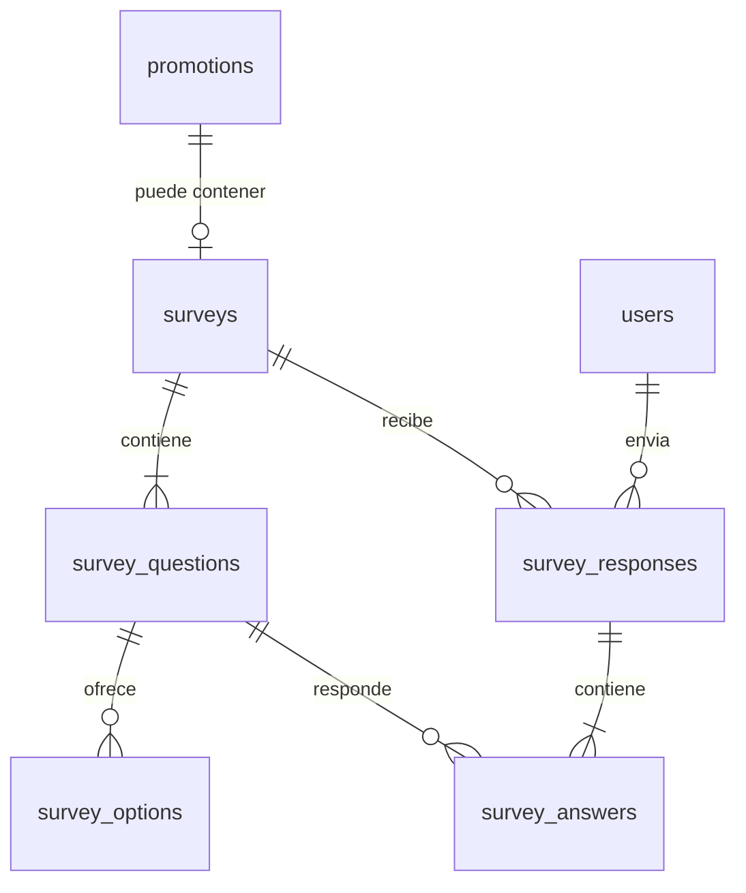
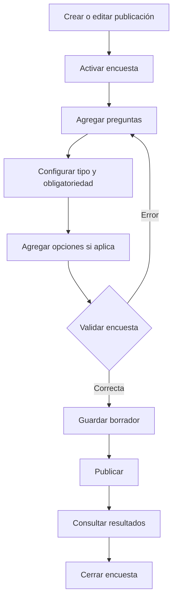
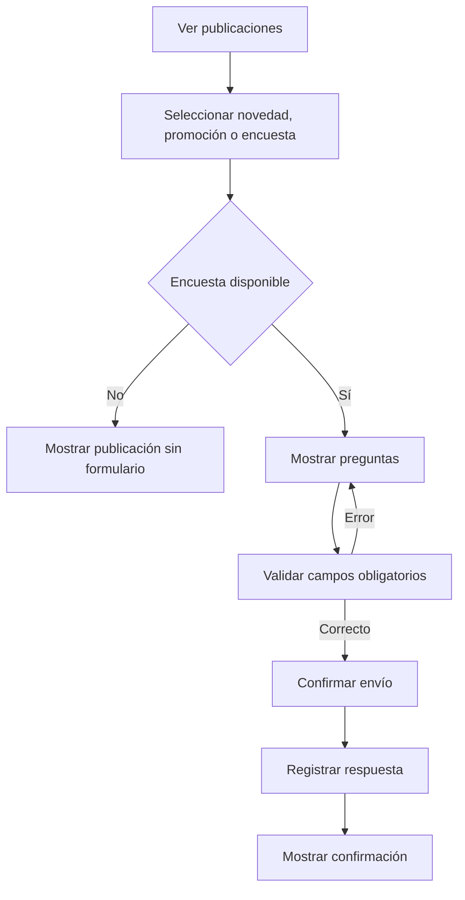

# Diseño técnico de encuestas

## 1. Propósito

Este documento define la arquitectura propuesta para incorporar encuestas como
un tercer tipo de publicación en el sistema de novedades y promociones de HPD
Glass.

Una publicación podrá ser una novedad (`news`), una promoción (`promotion`) o
una encuesta (`survey`). Cuando `promotions.type = survey`, la publicación
tendrá una configuración especializada en `surveys`, con varias preguntas,
opciones y respuestas. El documento sirve como especificación para desarrollar
las migraciones, API, permisos, interfaz administrativa, interfaz del cliente y
reportes.

> **Estado:** implementación inicial en progreso. Ya existen las migraciones,
> modelos, enum `survey`, creación de encuestas, consulta y envío de respuestas.
> La edición administrativa, resultados y la interfaz Vue todavía están
> pendientes.

### Implementación disponible

Actualmente el backend permite:

- Crear una publicación con `type_post = survey`.
- Crear una configuración de encuesta para esa publicación.
- Definir preguntas de selección, texto, escala y sí/no.
- Consultar una encuesta publicada.
- Registrar una respuesta por usuario autenticado.
- Actualizar título, descripción y fechas mientras no existan respuestas.
- Publicar una encuesta validada.
- Cerrar una encuesta.
- Consultar resultados agregados para usuarios autorizados.
- Consultar los participantes que respondieron, con nombre, correo, empresa y
  fecha de envío para usuarios administrativos autorizados.
- Restringir el acceso por audiencia, estado y fechas.

Endpoints implementados:

| Método | Ruta |
|---|---|
| `POST` | `/api/promotions/{promotion}/survey` |
| `GET` | `/api/surveys/{survey}` |
| `PUT/PATCH` | `/api/surveys/{survey}` |
| `POST` | `/api/surveys/{survey}/publish` |
| `POST` | `/api/surveys/{survey}/close` |
| `GET` | `/api/surveys/{survey}/results` |
| `GET` | `/api/surveys/{survey}/my-response` |
| `POST` | `/api/surveys/{survey}/responses` |

La interfaz administrativa para consumir estas operaciones y la edición de
preguntas/opciones desde Vue está disponible para crear una nueva publicación
de tipo `survey`. La edición estructural de preguntas existentes todavía queda
pendiente; las preguntas quedan bloqueadas después de que se registra la
primera respuesta.

La vista de resultados debe tratar los datos de participantes como información
administrativa. No debe mostrarlos a clientes ni incluirlos en la respuesta
del endpoint público de la encuesta.

## 2. Objetivos y alcance

### 2.1 Objetivos

- Permitir que un administrador cree una publicación de tipo `survey`.
- Permitir varias preguntas ordenadas en una misma encuesta.
- Soportar respuestas de selección, texto, escala y sí/no.
- Permitir marcar preguntas como obligatorias.
- Permitir una respuesta por usuario autenticado.
- Mostrar resultados agregados al personal autorizado.
- Mostrar novedades, promociones y encuestas dentro del mismo módulo de
  publicaciones.
- Evitar que la modificación de una encuesta publicada invalide sus resultados.

### 2.2 Incluido en el MVP

- Publicaciones con tipo `news`, `promotion` o `survey`.
- Encuestas vinculadas obligatoriamente a una publicación de tipo `survey`.
- Preguntas de selección única.
- Preguntas de selección múltiple.
- Preguntas de texto corto.
- Preguntas de texto largo.
- Preguntas de escala numérica.
- Preguntas de tipo sí/no.
- Opciones configurables para preguntas cerradas.
- Respuestas de usuarios autenticados.
- Validación de preguntas obligatorias.
- Una respuesta final por usuario y encuesta.
- Cierre manual o por fecha.
- Resultados agregados para administradores.

### 2.3 Fuera del MVP

- Respuestas anónimas.
- Encuestas públicas sin autenticación.
- Lógica condicional entre preguntas.
- Preguntas con imágenes o archivos.
- Edición de respuestas después del envío.
- Exportación a Excel o PDF.
- Notificaciones masivas.
- Integración con un sistema externo.

Estas capacidades pueden agregarse posteriormente sin reemplazar el modelo
principal.

## 3. Decisión de arquitectura

### 3.1 Encuesta como tipo de publicación

La encuesta será el tercer valor permitido en `promotions.type`:

| Valor interno | Nombre visible | Uso |
|---|---|---|
| `news` | Novedad | Publicación informativa |
| `promotion` | Promoción | Publicación comercial |
| `survey` | Encuesta | Publicación con formulario de preguntas |

La tabla `promotions` seguirá siendo la fuente de título, descripción, imagen,
audiencia, estado y fechas de publicación. Cuando el tipo sea `survey`, la
publicación tendrá exactamente una configuración relacionada en `surveys`.
Las preguntas y respuestas permanecerán en tablas especializadas para evitar
guardar estructuras variables directamente en `promotions`.

Relación propuesta:

```text
promotions (type = survey) 1 ─────── 1 surveys
surveys    1 ─────── N questions
questions  1 ─────── N options
surveys    1 ─────── N responses
responses  1 ─────── N answers
```

Una publicación de tipo `news` o `promotion` no debe tener una encuesta
asociada. Las tablas de encuesta se mantienen separadas para no sobrecargar
`promotions` con columnas específicas de preguntas y respuestas.

### 3.2 Reglas de negocio principales

1. Una publicación con `type = survey` debe tener una encuesta asociada.
2. Una encuesta solo puede asociarse a una publicación con `type = survey`.
3. Una encuesta necesita al menos una pregunta para publicarse.
4. Las preguntas tienen un orden único dentro de la encuesta.
5. Las opciones solo aplican a preguntas cerradas.
6. Las preguntas obligatorias deben contestarse antes del envío final.
7. Un usuario no puede registrar dos respuestas finales para la misma encuesta.
8. Una encuesta cerrada no acepta nuevas respuestas.
9. Una encuesta publicada con respuestas no debe modificar sus preguntas de
   forma destructiva.
10. Los resultados detallados solo están disponibles para roles autorizados.

## 4. Tipos de pregunta

| Código | Nombre visible | Valor almacenado | Respuesta |
|---|---|---|---|
| `single_choice` | Selección única | `string` | Una opción |
| `multiple_choice` | Selección múltiple | `array` | Una o más opciones |
| `short_text` | Texto corto | `string` | Texto con límite |
| `long_text` | Texto largo | `string` | Texto amplio |
| `scale` | Escala | `integer` | Número entre mínimo y máximo |
| `boolean` | Sí / No | `boolean` | `true` o `false` |

### 4.1 Validaciones por tipo

| Tipo | Reglas mínimas |
|---|---|
| `single_choice` | Debe seleccionar una opción perteneciente a la pregunta |
| `multiple_choice` | Array no vacío; opciones pertenecientes a la pregunta; sin duplicados |
| `short_text` | Cadena; longitud máxima recomendada: 255 caracteres |
| `long_text` | Cadena; longitud máxima definida por backend |
| `scale` | Entero dentro de `scale_min` y `scale_max` |
| `boolean` | Booleano; no aceptar valores arbitrarios como texto |

Las reglas deben ejecutarse en Laravel. La validación del frontend solo mejora
la experiencia y nunca sustituye la autorización ni la validación del backend.

## 5. Modelo de datos

### 5.1 Diagrama entidad-relación



### 5.2 Tabla `surveys`

Representa la configuración general de la encuesta.

| Campo | Tipo sugerido | Reglas |
|---|---|---|
| `id` | `BIGINT` | PK |
| `promotion_id` | `BIGINT` | FK a `promotions`, único |
| `title` | `VARCHAR(255)` | Título mostrado en el formulario |
| `description` | `TEXT` | Nullable |
| `status` | `VARCHAR(20)` | `draft`, `published`, `closed` |
| `starts_at` | `DATETIME` | Nullable |
| `ends_at` | `DATETIME` | Nullable |
| `published_at` | `DATETIME` | Nullable |
| `closed_at` | `DATETIME` | Nullable |
| `created_by` | `BIGINT` | FK a `users`, nullable si el proyecto lo requiere |
| `created_at` | `TIMESTAMP` | Timestamp |
| `updated_at` | `TIMESTAMP` | Timestamp |

Índices y restricciones:

- `UNIQUE (promotion_id)`.
- Índice sobre `status`.
- Índice sobre `starts_at` y `ends_at`.
- `ends_at` no debe ser anterior a `starts_at`.
- El cambio a `published` requiere preguntas válidas.

### 5.3 Tabla `survey_questions`

Define las preguntas y su orden.

| Campo | Tipo sugerido | Reglas |
|---|---|---|
| `id` | `BIGINT` | PK |
| `survey_id` | `BIGINT` | FK a `surveys`, cascade |
| `question` | `TEXT` | Texto visible |
| `type` | `VARCHAR(30)` | Uno de los tipos soportados |
| `position` | `UNSIGNED INT` | Orden dentro de la encuesta |
| `required` | `BOOLEAN` | Default `false` |
| `scale_min` | `UNSIGNED TINYINT` | Nullable; solo `scale` |
| `scale_max` | `UNSIGNED TINYINT` | Nullable; solo `scale` |
| `help_text` | `VARCHAR(500)` | Nullable |
| `created_at` | `TIMESTAMP` | Timestamp |
| `updated_at` | `TIMESTAMP` | Timestamp |

Índices y restricciones:

- Índice sobre `survey_id`.
- `UNIQUE (survey_id, position)`.
- Para `scale`, `scale_min < scale_max`.
- Para preguntas no numéricas, `scale_min` y `scale_max` deben ser `NULL`.

### 5.4 Tabla `survey_options`

Contiene las opciones de preguntas de selección.

| Campo | Tipo sugerido | Reglas |
|---|---|---|
| `id` | `BIGINT` | PK |
| `survey_question_id` | `BIGINT` | FK a `survey_questions`, cascade |
| `label` | `VARCHAR(255)` | Texto visible |
| `value` | `VARCHAR(100)` | Valor estable para la respuesta |
| `position` | `UNSIGNED INT` | Orden visual |
| `created_at` | `TIMESTAMP` | Timestamp |
| `updated_at` | `TIMESTAMP` | Timestamp |

Índices y restricciones:

- Índice sobre `survey_question_id`.
- `UNIQUE (survey_question_id, value)`.
- `UNIQUE (survey_question_id, position)`.
- Solo se permiten opciones para `single_choice` y
  `multiple_choice`.

### 5.5 Tabla `survey_responses`

Representa el envío final de un usuario.

| Campo | Tipo sugerido | Reglas |
|---|---|---|
| `id` | `BIGINT` | PK |
| `survey_id` | `BIGINT` | FK a `surveys`, cascade |
| `user_id` | `BIGINT` | FK a `users`, cascade o restrict según política |
| `submitted_at` | `DATETIME` | Fecha del envío final |
| `metadata` | `JSON` | Opcional; no almacenar secretos |
| `created_at` | `TIMESTAMP` | Timestamp |
| `updated_at` | `TIMESTAMP` | Timestamp |

Índices y restricciones:

- `UNIQUE (survey_id, user_id)`.
- Índice sobre `submitted_at`.
- No almacenar IP, user-agent u otros datos personales salvo que exista una
  necesidad documentada y una política de retención.

### 5.6 Tabla `survey_answers`

Almacena una respuesta por pregunta dentro de un envío.

| Campo | Tipo sugerido | Reglas |
|---|---|---|
| `id` | `BIGINT` | PK |
| `survey_response_id` | `BIGINT` | FK a `survey_responses`, cascade |
| `survey_question_id` | `BIGINT` | FK a `survey_questions`, restrict |
| `value` | `JSON` | Valor normalizado según el tipo |
| `created_at` | `TIMESTAMP` | Timestamp |
| `updated_at` | `TIMESTAMP` | Timestamp |

Ejemplos de `value`:

```json
// single_choice
"vidrio-templado"

// multiple_choice
["instalacion", "mantenimiento"]

// short_text / long_text
"La atención fue rápida."

// scale
5

// boolean
true
```

Restricción recomendada:

- `UNIQUE (survey_response_id, survey_question_id)`.

El servicio de respuestas debe comprobar que la pregunta pertenece a la
encuesta antes de guardar el registro. Esto evita enviar una pregunta de otra
encuesta manipulando la solicitud HTTP.

## 6. Estados de la encuesta

| Estado | Descripción | Acepta respuestas |
|---|---|---|
| `draft` | Edición administrativa | No |
| `published` | Disponible para usuarios dentro de las fechas configuradas | Sí |
| `closed` | Cerrada manualmente o por fecha | No |

Reglas:

- `draft` puede editarse libremente.
- `published` puede mostrar resultados y recibir respuestas.
- `closed` conserva resultados, pero no permite nuevos envíos.
- Si `ends_at` ya pasó, la API debe tratar la encuesta como cerrada aunque el
  valor persistido todavía sea `published`.
- El cambio de estado debe registrarse en logs de aplicación cuando sea
  relevante para auditoría.

## 7. Flujo funcional

### 7.1 Flujo del administrador



### 7.2 Flujo del cliente



El formulario puede permitir guardar respuestas temporales en memoria, pero el
registro definitivo solo debe crearse cuando el usuario confirme el envío.

## 8. API propuesta

Todos los endpoints deben estar dentro del grupo `auth:api`, igual que los
recursos protegidos actuales.

### 8.1 Administración

La creación debe comenzar desde el recurso `promotions`, usando
`type = survey`. La API puede reutilizar el formulario de publicaciones y
después crear la configuración especializada de la encuesta.

| Método | Ruta | Acción |
|---|---|---|
| `GET` | `/api/promotions/{promotion}/survey` | Consultar encuesta de una publicación tipo `survey` |
| `POST` | `/api/promotions/{promotion}/survey` | Crear configuración para una publicación tipo `survey` |
| `PUT/PATCH` | `/api/surveys/{survey}` | Actualizar configuración |
| `DELETE` | `/api/surveys/{survey}` | Eliminar encuesta en borrador |
| `POST` | `/api/surveys/{survey}/publish` | Publicar encuesta |
| `POST` | `/api/surveys/{survey}/close` | Cerrar encuesta |
| `GET` | `/api/surveys/{survey}/results` | Consultar resultados agregados |

### 8.2 Preguntas y opciones

| Método | Ruta | Acción |
|---|---|---|
| `POST` | `/api/surveys/{survey}/questions` | Crear pregunta |
| `PUT/PATCH` | `/api/survey-questions/{question}` | Actualizar pregunta |
| `DELETE` | `/api/survey-questions/{question}` | Eliminar pregunta en borrador |
| `POST` | `/api/survey-questions/{question}/options` | Crear opción |
| `PUT/PATCH` | `/api/survey-options/{option}` | Actualizar opción |
| `DELETE` | `/api/survey-options/{option}` | Eliminar opción |
| `POST` | `/api/surveys/{survey}/reorder-questions` | Reordenar preguntas |

### 8.3 Cliente

| Método | Ruta | Acción |
|---|---|---|
| `GET` | `/api/surveys/{survey}` | Obtener encuesta disponible |
| `GET` | `/api/surveys/{survey}/my-response` | Consultar si ya respondió |
| `POST` | `/api/surveys/{survey}/responses` | Enviar respuesta final |

El endpoint `GET` para clientes no debe devolver información administrativa
como totales de respuestas, identificadores internos innecesarios o respuestas
de otros usuarios.

### 8.4 Ejemplo para crear una encuesta

```json
{
  "title": "¿Cómo fue tu experiencia?",
  "description": "Tu opinión nos ayuda a mejorar el servicio.",
  "starts_at": "2026-10-01T00:00:00-05:00",
  "ends_at": "2026-10-31T23:59:59-05:00",
  "questions": [
    {
      "question": "¿Qué tan satisfecho estás con la atención?",
      "type": "scale",
      "required": true,
      "scale_min": 1,
      "scale_max": 5,
      "position": 1
    },
    {
      "question": "¿Qué servicio utilizaste?",
      "type": "single_choice",
      "required": true,
      "position": 2,
      "options": [
        {
          "label": "Cotización",
          "value": "quotation",
          "position": 1
        },
        {
          "label": "Atención comercial",
          "value": "sales_attention",
          "position": 2
        }
      ]
    }
  ]
}
```

### 8.5 Ejemplo para enviar respuestas

```json
{
  "answers": [
    {
      "question_id": 1,
      "value": 5
    },
    {
      "question_id": 2,
      "value": "quotation"
    },
    {
      "question_id": 3,
      "value": ["speed", "communication"]
    }
  ]
}
```

El backend debe crear `survey_responses` y `survey_answers` dentro de una
transacción. Si una respuesta falla, no debe quedar un envío incompleto.

### 8.6 Códigos HTTP esperados

| Código | Uso |
|---|---|
| `200` | Consulta o actualización correcta |
| `201` | Recurso creado |
| `204` | Eliminación correcta sin contenido |
| `401` | Usuario no autenticado |
| `403` | Usuario autenticado sin permiso |
| `404` | Encuesta, pregunta u opción inexistente |
| `409` | El usuario ya respondió o existe conflicto de estado |
| `422` | Validación de datos fallida |
| `429` | Límite de solicitudes excedido |

## 9. Backend Laravel

### 9.1 Modelos sugeridos

Crear los modelos:

- `App\Models\Survey`
- `App\Models\SurveyQuestion`
- `App\Models\SurveyOption`
- `App\Models\SurveyResponse`
- `App\Models\SurveyAnswer`

Relaciones esperadas:

```php
// Survey
public function promotion(): BelongsTo;
public function questions(): HasMany;
public function responses(): HasMany;

// SurveyQuestion
public function survey(): BelongsTo;
public function options(): HasMany;
public function answers(): HasMany;

// SurveyResponse
public function survey(): BelongsTo;
public function user(): BelongsTo;
public function answers(): HasMany;
```

Usar `$casts` para `required`, fechas y `SurveyAnswer::value`. No usar
serialización manual duplicada si el cast de Eloquent resuelve el caso.

### 9.2 Controladores

Separar responsabilidades:

- `PromotionSurveyController`: encuesta asociada a una publicación.
- `SurveyController`: configuración, publicación y cierre.
- `SurveyQuestionController`: preguntas.
- `SurveyOptionController`: opciones.
- `SurveyResponseController`: envío del cliente y consulta de respuesta propia.
- `SurveyResultController`: resultados agregados.

Si el proyecto prefiere reducir el número de controladores, puede agrupar
acciones relacionadas, pero no se debe mezclar la lógica de cálculo de
resultados directamente en las vistas o requests.

### 9.3 Servicios

Se recomienda crear:

- `SurveyService`: crear, actualizar, publicar y cerrar.
- `SurveyResponseService`: validar y guardar respuestas dentro de transacción.
- `SurveyResultService`: calcular totales, porcentajes y promedios.

El servicio de respuestas debe:

1. Cargar la encuesta con sus preguntas y opciones.
2. Comprobar que está disponible.
3. Comprobar que el usuario no tiene una respuesta final.
4. Validar cada valor según el tipo de pregunta.
5. Comprobar preguntas obligatorias.
6. Crear la respuesta y sus detalles en una transacción.
7. Devolver una respuesta sin datos privados de otros usuarios.

### 9.4 Form Requests

Requests sugeridos:

- `StoreSurveyRequest`
- `UpdateSurveyRequest`
- `StoreSurveyQuestionRequest`
- `UpdateSurveyQuestionRequest`
- `StoreSurveyOptionRequest`
- `SubmitSurveyResponseRequest`

La validación de `SubmitSurveyResponseRequest` debe ser dinámica porque las
reglas dependen de las preguntas almacenadas. Puede usarse una validación base
en el Form Request y una segunda validación de dominio en
`SurveyResponseService`.

### 9.5 Resources

Resources sugeridos:

- `SurveyResource`
- `SurveyQuestionResource`
- `SurveyOptionResource`
- `SurveyResponseResource`
- `SurveyResultResource`

`SurveyResponseResource` para administradores puede incluir información
agregada, pero nunca debe exponer más datos personales de los necesarios.

## 10. Autorización y seguridad

### 10.1 Roles

La autorización debe seguir la combinación existente:

- Laravel Passport identifica al usuario.
- Spatie Laravel Permission administra roles y permisos.
- Policies autorizan acciones sobre registros concretos.
- CASL controla la visibilidad de acciones en el frontend.

Permisos sugeridos:

| Permiso | Uso |
|---|---|
| `surveys.view` | Ver encuestas permitidas |
| `surveys.create` | Crear encuestas |
| `surveys.update` | Editar encuestas |
| `surveys.publish` | Publicar encuestas |
| `surveys.close` | Cerrar encuestas |
| `surveys.delete` | Eliminar borradores |
| `surveys.results` | Ver resultados |
| `surveys.respond` | Enviar respuestas |

El nombre final debe respetar la convención de permisos ya existente en el
backend.

### 10.2 Policies

Crear `SurveyPolicy` con métodos similares a:

- `viewAny`
- `view`
- `create`
- `update`
- `delete`
- `publish`
- `close`
- `viewResults`
- `respond`

La policy debe comprobar tanto el permiso como el estado del recurso. Ocultar
un botón con CASL no es suficiente: cada endpoint debe volver a autorizar.

### 10.3 Protección contra abuso

- Aplicar rate limiting al endpoint de envío.
- Usar la restricción única `(survey_id, user_id)` como última defensa.
- No confiar en `user_id` enviado por el frontend; obtenerlo de
  `auth()->user()`.
- Comprobar que cada `question_id` pertenece a la encuesta solicitada.
- Comprobar que cada opción pertenece a la pregunta.
- Escapar el texto al mostrar resultados.
- No permitir HTML arbitrario en preguntas y opciones.
- Registrar errores de validación sin almacenar respuestas sensibles en logs.

## 11. Interfaz frontend Vue/Vuetify

### 11.1 Administración

Crear una sección dentro del formulario de publicación o una vista específica:

- Seleccionar el tipo de publicación: Novedad, Promoción o Encuesta.
- Crear la publicación con `type = survey`.
- Editar título y descripción.
- Agregar, eliminar y reordenar preguntas.
- Elegir tipo de pregunta.
- Marcar pregunta obligatoria.
- Administrar opciones.
- Configurar escala mínima y máxima.
- Configurar fechas.
- Guardar borrador.
- Publicar.
- Cerrar.
- Ver resultados.

Componentes sugeridos:

- `SurveyBuilder.vue`
- `SurveyQuestionEditor.vue`
- `SurveyOptionEditor.vue`
- `SurveyResults.vue`

### 11.2 Cliente

La vista de publicaciones debe mostrar filtros o pestañas equivalentes a:

```text
Todas | Novedades | Promociones | Encuestas
```

Una tarjeta de tipo `survey` debe mostrar una etiqueta **Encuesta** y un botón
**Responder encuesta**. La vista de detalle de la publicación debe:

1. Mostrar el formulario solo si la publicación es de tipo `survey`, está
   publicada y se encuentra disponible.
2. Renderizar el control según `question.type`.
3. Mostrar indicador de pregunta obligatoria.
4. Validar antes de enviar.
5. Pedir confirmación antes del envío final.
6. Deshabilitar el formulario durante la solicitud.
7. Mostrar confirmación después de guardar.
8. Mostrar que el usuario ya respondió si corresponde.

Controles Vuetify sugeridos:

| Tipo | Componente |
|---|---|
| `single_choice` | `VRadioGroup` |
| `multiple_choice` | `VCheckbox` |
| `short_text` | `VTextField` |
| `long_text` | `VTextarea` |
| `scale` | `VSlider` o `VRadioGroup` |
| `boolean` | `VSwitch` o `VRadioGroup` |

### 11.3 Estado frontend

El composable sugerido es `useSurvey` y debe centralizar:

- Carga de la encuesta.
- Estado de carga.
- Estado de envío.
- Errores de API.
- Respuestas locales.
- Consulta de `my-response`.
- Envío final.

No duplicar la lógica de validación y transformación en cada componente.

## 12. Resultados

### 12.1 Indicadores mínimos

- Total de respuestas.
- Tasa de participación si existe una población conocida.
- Conteo y porcentaje por opción.
- Promedio, mínimo y máximo para escalas.
- Conteo de respuestas sí/no.
- Lista de respuestas de texto para usuarios autorizados.

### 12.2 Respuesta agregada de resultados

Ejemplo conceptual:

```json
{
  "survey_id": 10,
  "total_responses": 42,
  "questions": [
    {
      "question_id": 1,
      "type": "scale",
      "average": 4.4,
      "distribution": {
        "1": 0,
        "2": 1,
        "3": 3,
        "4": 17,
        "5": 21
      }
    },
    {
      "question_id": 2,
      "type": "single_choice",
      "options": [
        {
          "value": "quotation",
          "label": "Cotización",
          "count": 30,
          "percentage": 71.43
        }
      ]
    }
  ]
}
```

Los porcentajes deben calcularse en backend para que todos los clientes
obtengan el mismo resultado. Redondear únicamente al presentar, no al guardar.

## 13. Migraciones y seeders

Antes de crear las tablas de encuesta, agregar `survey` como valor permitido
para `promotions.type` y actualizar la validación del recurso de promociones.
La publicación de tipo `survey` no debe quedar publicada sin su configuración
de encuesta válida.

Orden recomendado:

1. `add_survey_type_to_promotions`
2. `create_surveys_table`
3. `create_survey_questions_table`
4. `create_survey_options_table`
5. `create_survey_responses_table`
6. `create_survey_answers_table`
7. Seeder de permisos de encuesta

Los seeders de datos deben usar contenido genérico de pruebas y no incluir
empresas competidoras, credenciales, tokens ni información real de clientes.

Antes de ejecutar `migrate:fresh --seed`, revisar que los seeders respeten las
dependencias entre usuarios, publicaciones, encuestas y permisos.

## 14. Pruebas requeridas

### 14.1 Unitarias

- Validación de cada tipo de pregunta.
- Validación de escalas.
- Cálculo de porcentajes.
- Cálculo de promedios.
- Transición de estados.
- Rechazo de opciones pertenecientes a otra pregunta.

### 14.2 Feature/API

- Crear encuesta con permiso.
- Rechazar creación sin permiso.
- Publicar encuesta sin preguntas.
- Publicar encuesta válida.
- Consultar encuesta disponible.
- Enviar respuesta válida.
- Rechazar respuesta incompleta.
- Rechazar respuesta duplicada.
- Rechazar respuesta cuando la encuesta está cerrada.
- Consultar resultados con permiso.
- Rechazar resultados sin permiso.

### 14.3 Frontend

- Renderizar cada tipo de pregunta.
- Mostrar errores de validación.
- Deshabilitar el botón durante el envío.
- Mostrar confirmación después de responder.
- Ocultar resultados al cliente normal.
- Mostrar correctamente encuestas cerradas.

## 15. Plan de implementación por fases

### Fase 1: base de datos y dominio

- Crear migraciones.
- Crear modelos y relaciones.
- Crear casts y scopes.
- Crear permisos.
- Crear `SurveyPolicy`.

### Fase 2: administración backend

- Crear requests.
- Crear resources.
- Crear servicios.
- Crear endpoints de administración.
- Implementar publicación y cierre.

### Fase 3: respuestas del cliente

- Crear endpoint de encuesta disponible.
- Crear `SubmitSurveyResponseRequest`.
- Implementar transacción de respuestas.
- Agregar restricción de una respuesta por usuario.
- Aplicar rate limiting.

### Fase 4: administración frontend

- Crear constructor de encuestas.
- Agregar editor de preguntas y opciones.
- Agregar fechas y estados.
- Integrar permisos CASL.

### Fase 5: formulario del cliente

- Crear composable.
- Crear renderizado dinámico.
- Agregar validación visual.
- Agregar confirmación y estado respondido.

### Fase 6: resultados y endurecimiento

- Crear resultados agregados.
- Agregar gráficos o tablas.
- Probar autorización.
- Revisar consultas N+1.
- Ejecutar pruebas y typecheck.
- Actualizar el manual técnico y el diccionario de base de datos.

## 16. Criterios de aceptación

La funcionalidad se considerará lista cuando:

- Un administrador autorizado pueda crear una encuesta con varias preguntas.
- Se puedan combinar al menos tres tipos de pregunta en una misma encuesta.
- La encuesta pueda publicarse únicamente si es válida.
- Un cliente autenticado pueda responderla desde la publicación.
- El sistema impida el doble envío.
- Las respuestas se almacenen dentro de una transacción.
- Una encuesta cerrada no acepte respuestas.
- Un usuario sin permiso no pueda consultar resultados mediante API.
- Los resultados agregados coincidan con las respuestas almacenadas.
- Existan pruebas backend para reglas críticas.
- `php artisan test` y `npm run typecheck` pasen sin errores.
- La documentación de API y base de datos esté actualizada.

## 17. Decisiones pendientes antes de programar

Estas decisiones deben confirmarse antes de cerrar las migraciones:

1. ¿La respuesta será exclusivamente para usuarios autenticados?
2. ¿Se permitirá modificar una respuesta antes de la fecha de cierre?
3. ¿Los administradores podrán ver textos individuales o solo estadísticas?
4. ¿La encuesta se mostrará a todos los clientes o respetará la audiencia de
   `promotion_customer`?
5. ¿La edición de preguntas quedará bloqueada después de publicar?
6. ¿Se necesita exportación a Excel en la primera versión?
7. ¿Debe enviarse una notificación cuando se publique una encuesta?

La recomendación para el MVP es:

- Solo usuarios autenticados.
- Una respuesta final sin edición.
- Resultados agregados para administradores autorizados.
- Respetar la audiencia de la publicación.
- Bloquear cambios estructurales después de la primera respuesta.
- Dejar exportación y notificaciones para una fase posterior.

## 18. Checklist de desarrollo

### Backend

- [ ] Crear las cinco migraciones.
- [ ] Permitir `survey` en `promotions.type`.
- [ ] Validar que una publicación `survey` tenga configuración de encuesta.
- [ ] Agregar índices y restricciones únicas.
- [ ] Crear modelos y relaciones.
- [ ] Crear requests y resources.
- [ ] Crear servicios.
- [ ] Crear controllers y rutas.
- [ ] Crear policy y permisos.
- [ ] Agregar rate limiting.
- [ ] Agregar pruebas de dominio y API.

### Frontend

- [ ] Crear servicio API o composable.
- [ ] Crear constructor administrativo.
- [ ] Crear editor de preguntas.
- [ ] Crear formulario dinámico del cliente.
- [ ] Integrar CASL.
- [ ] Crear vista de resultados.
- [ ] Agregar estados de carga y error.
- [ ] Ejecutar `npm run typecheck`.

### Documentación

- [ ] Actualizar `MANUAL-TECNICO.md`.
- [ ] Actualizar `BASE-DE-DATOS.md`.
- [ ] Documentar endpoints definitivos.
- [ ] Documentar permisos definitivos.
- [ ] Documentar decisiones finales.
