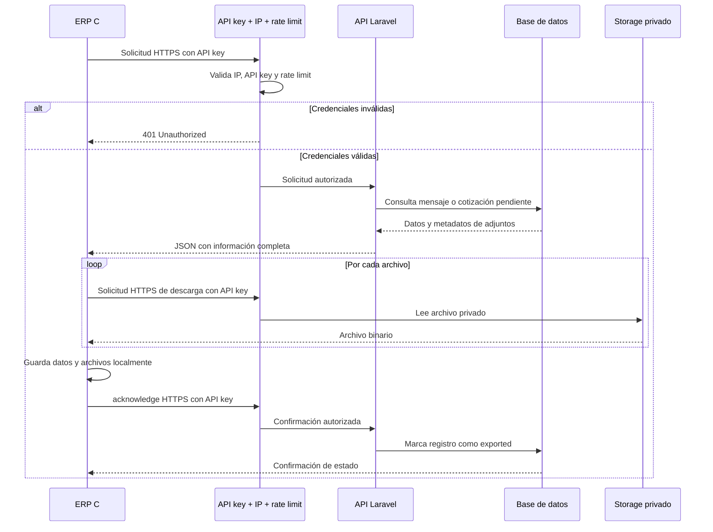
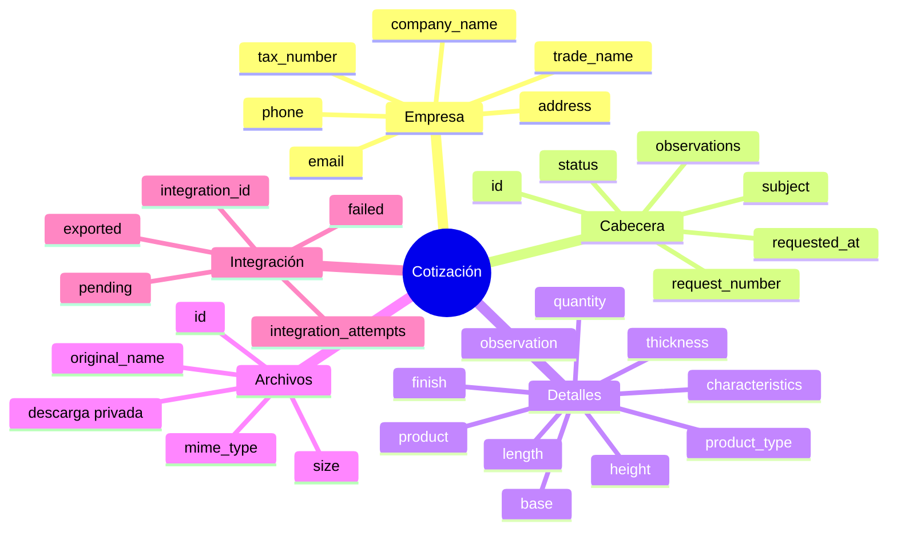

# Integración ERP C# .NET: mensajes de Contáctanos

## Flujo operativo resumido



## Estructura de una cotización para el ERP



## Objetivo

Esta API permite que el ERP local desarrollado en C# .NET consulte los mensajes enviados desde el formulario Contáctanos, descargue sus archivos adjuntos y confirme si fueron importados correctamente.

La misma seguridad y flujo se utiliza también para integrar las cotizaciones.

## Seguridad

La integración utiliza una API key independiente de los usuarios del frontend,
una lista blanca de IPs y un límite de solicitudes por minuto.

Configurar en el `.env` del backend:

```env
ERP_INTEGRATION_API_KEY=generar-una-clave-larga-y-segura
ERP_INTEGRATION_ALLOWED_IPS=181.65.20.10
```

Todas las solicitudes del ERP deben incluir:

```http
X-Integration-Key: generar-una-clave-larga-y-segura
Accept: application/json
```

Laravel valida primero la IP pública desde la que sale el ERP y después la API
key. Las rutas de integración tienen un límite de 60 solicitudes por minuto
por IP. Usar siempre HTTPS fuera del entorno local y no enviar la API key en la
URL ni en el cuerpo de la solicitud.

`ERP_INTEGRATION_ALLOWED_IPS` debe contener la IP pública del router de la
empresa, no una IP privada como `192.168.1.50`. Si la empresa tiene IP
dinámica, se recomienda contratar una IP fija o utilizar una VPN.

## URL base

Entorno local:

```text
http://localhost/api
```

Producción:

```text
https://dominio-del-backend.com/api
```

## Estados de integración

| Estado | Descripción |
|---|---|
| `pending` | Mensaje disponible para ser importado por el ERP. |
| `exported` | El ERP confirmó que lo importó correctamente. |
| `failed` | El ERP reportó un error al procesarlo. |

El ERP debe guardar el `id` de Laravel y su propio identificador para evitar duplicados.

## Endpoints

### Consultar mensajes pendientes

```http
GET /integrations/contact-messages?status=pending&per_page=50
```

Parámetros:

| Parámetro | Tipo | Descripción |
|---|---|---|
| `status` | string | `pending`, `exported` o `failed`. Por defecto: `pending`. |
| `per_page` | integer | Cantidad de registros. Mínimo 1 y máximo 100. |
| `page` | integer | Página solicitada. |

Respuesta:

```json
{
  "data": [
    {
      "id": 152,
      "full_name": "Juan Pérez",
      "email": "juan@example.com",
      "phone": "+51 999 999 999",
      "message": "Solicito información sobre sus productos.",
      "sent_at": "2026-09-15T14:20:00.000000Z",
      "customer_id": 8,
      "customer": {
        "id": 8,
        "company_name": "Empresa SAC",
        "tax_number": "20123456789"
      },
      "integration_status": "pending",
      "integration_id": null,
      "integration_error": null,
      "integration_processed_at": null,
      "integration_attempts": 0,
      "attachments": [
        {
          "id": 25,
          "original_name": "catalogo.pdf",
          "mime_type": "application/pdf",
          "size": 245760
        }
      ]
    }
  ],
  "links": {},
  "meta": {}
}
```

### Consultar un mensaje

```http
GET /integrations/contact-messages/{contactMessageId}
```

Devuelve el mismo formato de un elemento de `data`.

### Descargar un adjunto

```http
GET /integrations/contact-messages/{contactMessageId}/attachments/{attachmentId}
```

La respuesta JSON no contiene el archivo binario. Cada adjunto incluye
`download_url`, que apunta a este endpoint protegido. El ERP debe solicitar esa
URL enviando `X-Integration-Key` y desde una IP autorizada, y conservar el
archivo usando `original_name`.

Los archivos se almacenan en el backend dentro de:

```text
storage/app/private/contact-messages/{id}/attachments
```

No son públicos. El ERP debe enviar la API key también al descargar cada archivo.

### Confirmar importación

```http
POST /integrations/contact-messages/{contactMessageId}/acknowledge
Content-Type: application/json
```

Body:

```json
{
  "integration_id": "ERP-CONTACT-001"
}
```

El mensaje pasa a `exported`.

### Reportar error

```http
POST /integrations/contact-messages/{contactMessageId}/fail
Content-Type: application/json
```

Body:

```json
{
  "error": "No se pudo registrar el mensaje en el ERP."
}
```

El mensaje pasa a `failed` y aumenta `integration_attempts`.

## Códigos HTTP

| Código | Significado |
|---|---|
| `200` | Solicitud procesada correctamente. |
| `401` | API key ausente o inválida. |
| `404` | Mensaje o adjunto inexistente. |
| `422` | Datos inválidos en la solicitud. |
| `500` | Error inesperado del backend. |

## Flujo recomendado del ERP

1. Consultar mensajes con `status=pending`.
2. Para cada mensaje, comprobar si su `id` ya fue importado.
3. Descargar todos los adjuntos.
4. Guardar los datos y archivos en el ERP dentro de una transacción.
5. Confirmar con `acknowledge` solo si todo fue guardado correctamente.
6. En caso de error, llamar a `fail`.
7. Reintentar posteriormente los mensajes con estado `failed`.

No confirmar el mensaje antes de terminar la descarga y el guardado local de sus adjuntos.

## Integración de cotizaciones

El ERP puede consultar las solicitudes de cotización que ya fueron enviadas por la
empresa. Por defecto solo se devuelven cotizaciones con estado comercial `Pendiente`
y estado de integración `pending`; de esta forma no se exportan borradores.

### Consultar cotizaciones pendientes

```http
GET /integrations/quote-requests?status=pending&per_page=50
```

Cada elemento incluye:

- `company`: empresa que generó la cotización, incluyendo sus datos fiscales y de contacto.
- `request_number`: número de solicitud.
- `subject`: asunto.
- `observations`: observaciones generales.
- `requested_at`: fecha de solicitud.
- `products`: líneas de productos con código, nombre, tipo, acabado, longitud,
  espesor, medidas, cantidad, observación y características adicionales.
- `attachments`: archivos asociados con nombre original, MIME, tamaño,
  identificador y `download_url`.

Los parámetros `status`, `per_page` y `page` funcionan igual que en mensajes de
contacto. Para consultar una cotización específica:

```http
GET /integrations/quote-requests/{quoteRequestId}
```

### Descargar archivos de una cotización

```http
GET /integrations/quote-requests/{quoteRequestId}/attachments/{attachmentId}
```

La respuesta es binaria y requiere la misma API key y una IP autorizada. La URL
aparece en `attachments[].download_url`; el contenido no se envía dentro del
JSON y los archivos se mantienen privados en el backend.

### Confirmar o reportar una cotización

Después de guardar la cotización y todos sus archivos en el ERP:

```http
POST /integrations/quote-requests/{quoteRequestId}/acknowledge
Content-Type: application/json

{
  "integration_id": "ERP-QUOTE-001"
}
```

Si ocurre un error:

```http
POST /integrations/quote-requests/{quoteRequestId}/fail
Content-Type: application/json

{
  "error": "No se pudo registrar el detalle de la cotización."
}
```

Las cotizaciones utilizan los mismos estados de integración `pending`, `exported` y
`failed`. El ERP debe guardar el identificador de Laravel (`id`) y
`request_number` para evitar duplicados.

## Ejemplo en C# .NET

```csharp
using System.Net.Http.Json;

using var client = new HttpClient
{
    BaseAddress = new Uri("https://dominio-del-backend.com/api/")
};

var apiKey = Environment.GetEnvironmentVariable("ERP_INTEGRATION_API_KEY")!;
client.DefaultRequestHeaders.Add("X-Integration-Key", apiKey);

var response = await client.GetAsync(
    "integrations/contact-messages?status=pending&per_page=50"
);

response.EnsureSuccessStatusCode();

var result = await response.Content
    .ReadFromJsonAsync<ContactMessagesResponse>();
```

Descargar un archivo:

```csharp
var fileResponse = await client.GetAsync(
    $"integrations/contact-messages/{message.Id}/attachments/{attachment.Id}",
);

fileResponse.EnsureSuccessStatusCode();

await using var stream = await fileResponse.Content.ReadAsStreamAsync();
await using var file = File.Create(
    Path.Combine("adjuntos", attachment.OriginalName)
);

await stream.CopyToAsync(file);
```

Confirmar:

```csharp
var acknowledgeResponse = await client.PostAsJsonAsync(
    $"integrations/contact-messages/{message.Id}/acknowledge",
    new { integration_id = $"ERP-CONTACT-{message.Id}" }
);

acknowledgeResponse.EnsureSuccessStatusCode();
```

## Recomendaciones

- Guardar la API key en variables de entorno o en el almacén seguro de credenciales del servidor.
- No registrar la API key en logs.
- Usar HTTPS en producción.
- Implementar reintentos con espera progresiva.
- Registrar en el ERP el `id` de Laravel, `integration_id` y estado de importación.
- No marcar como `exported` si falla la descarga de un adjunto.
