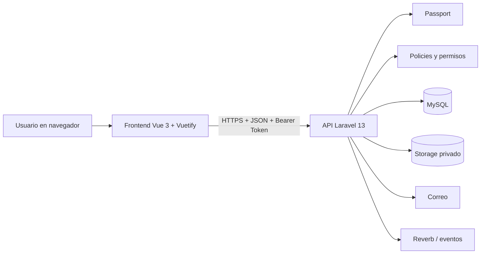
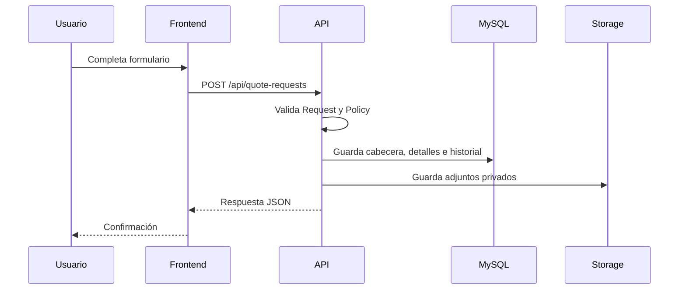
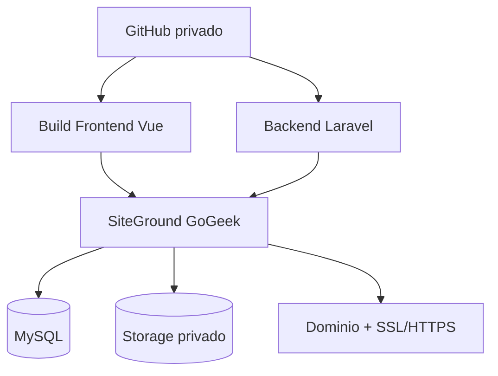
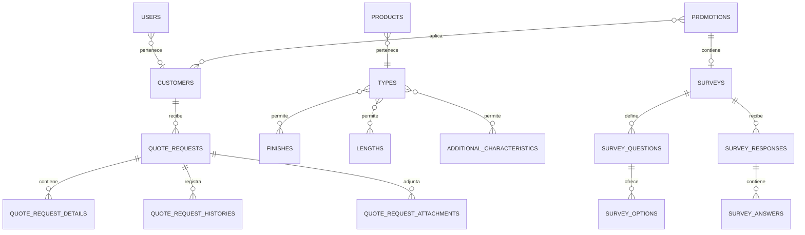
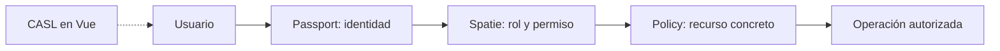

# Manual Técnico — Cotizador Web HPD Glass

**Versión:** 1.0
**Fecha:** septiembre de 2026  
**Organización:** HPD Glass Group  
**Aplicaciones:** `frontend-quotations` y backend Laravel  
**Audiencia:** desarrollo, soporte, infraestructura, QA y administración

> Este documento describe el sistema real implementado. No contiene contraseñas, tokens, API keys ni credenciales reales. Los valores de producción deben mantenerse en variables de entorno o en el gestor seguro del hosting.

## Índice

1. [Introducción](#1-introducción)
2. [Arquitectura del sistema](#2-arquitectura-del-sistema)
3. [Tecnologías y herramientas](#3-tecnologías-y-herramientas)
4. [Estructura del proyecto](#4-estructura-del-proyecto)
5. [Base de datos](#5-base-de-datos)
6. [API](#6-api)
7. [Autenticación, roles y seguridad](#7-autenticación-roles-y-seguridad)
8. [Funcionalidades del sistema](#8-funcionalidades-del-sistema)
9. [Diseño e identidad visual](#9-diseño-e-identidad-visual)
10. [Configuración del entorno](#10-configuración-del-entorno)
11. [Despliegue en producción](#11-despliegue-en-producción)
12. [Tareas programadas y procesos](#12-tareas-programadas-y-procesos)
13. [Gestión de archivos](#13-gestión-de-archivos)
14. [Backups y recuperación](#14-backups-y-recuperación)
15. [Logs y mantenimiento](#15-logs-y-mantenimiento)
16. [Solución de problemas](#16-solución-de-problemas)
17. [Control de versiones](#17-control-de-versiones)
18. [Anexos](#18-anexos)

---

## 1. Introducción

### Objetivo del sistema

El Cotizador Web HPD Glass permite que usuarios autenticados consulten el catálogo comercial y registren solicitudes de cotización. Una solicitud puede contener productos, medidas, cantidades, características adicionales, observaciones y archivos adjuntos.

También permite administrar:

- Empresas y clientes.
- Usuarios y permisos.
- Catálogo comercial.
- Novedades y promociones.
- Encuestas asociadas a publicaciones.
- Mensajes de contacto.
- Notificaciones.
- Historial y estados de cotizaciones.

### Alcance del proyecto

El proyecto está dividido en:

| Aplicación | Responsabilidad |
|---|---|
| Frontend Vue | Interfaz web, navegación, formularios, validaciones visuales y consumo de API |
| Backend Laravel | API, autenticación, autorización, reglas de negocio, persistencia y archivos |
| MySQL | Información de usuarios, empresas, catálogo y operación comercial |
| Almacenamiento privado | Adjuntos de cotizaciones, contacto y promociones |

### Descripción general

El usuario inicia sesión, consulta las opciones disponibles para su empresa y crea una cotización. El frontend envía la información a Laravel. Laravel valida la petición, verifica permisos, guarda la cabecera y los detalles, almacena los archivos de forma privada y devuelve una respuesta JSON.

### Objetivo del manual

Este documento permite:

1. Entender qué hace el sistema.
2. Instalarlo localmente.
3. Mantenerlo y modificarlo.
4. Desplegarlo en producción.
5. Diagnosticar errores.
6. Recuperarlo ante una caída.

### Público objetivo

- **Programadores:** estructura, rutas, modelos, servicios, pruebas y comandos.
- **QA:** funcionalidades, estados, validaciones y pruebas.
- **Infraestructura:** variables, hosting, backups, permisos y procesos.
- **Administración:** módulos, flujo comercial y alcance funcional.

---

## 2. Arquitectura del sistema

### Arquitectura general



### Flujo de una solicitud



### Frontend Vue.js

El frontend utiliza Vue 3 con `<script setup lang="ts">`. La pantalla de creación de cotizaciones está en:

- `src/views/apps/quote-requests/QuoteRequestCreate.vue`
- `src/views/apps/quote-requests/QuoteRequestProductTable.vue`
- `src/views/apps/quote-requests/QuoteRequestAttachments.vue`

El tour de cotizaciones utiliza Shepherd.js y se guarda en `localStorage` con la clave `quote-request-tour-completed`.

### Backend Laravel

El backend utiliza Laravel 13 y PHP 8.3. Sus responsabilidades son:

- Autenticar usuarios.
- Validar entradas.
- Verificar permisos.
- Ejecutar reglas comerciales.
- Persistir datos.
- Servir respuestas JSON.
- Proteger archivos.
- Enviar notificaciones.

### Base de datos MySQL

MySQL es el motor recomendado para producción. SQLite está disponible para ciertos entornos locales o pruebas si la configuración del proyecto lo permite.

### Comunicación Frontend ↔ API

Las peticiones protegidas incluyen:

```http
Accept: application/json
Authorization: Bearer TOKEN
```

En desarrollo, Vite reenvía `/api` hacia `http://127.0.0.1:8000`. Esto evita que muchas peticiones relativas requieran CORS directo. Una petición directa al backend sí depende de `FRONTEND_URL`.

### Servicios externos utilizados

| Servicio | Uso |
|---|---|
| GitHub | Repositorios privados y Pull Requests |
| Servicio de correo | Notificaciones y correos comerciales |
| Laravel Reverb | Eventos y notificaciones en tiempo real |
| Mapbox | Mapas cuando una pantalla lo requiere |
| S3 compatible | Almacenamiento privado opcional |
| SiteGround GoGeek | Infraestructura objetivo de producción |

### Infraestructura de producción en SiteGround GoGeek



La configuración exacta de PHP, document root, Cron, Queue y procesos persistentes debe confirmarse en la cuenta de SiteGround.

---

## 3. Tecnologías y herramientas

### Frontend

| Tecnología | Versión/configuración | Uso |
|---|---|---|
| Vue | 3.5.x | Componentes y vistas |
| TypeScript | 5.9.x | Tipado estático |
| Vuetify | 3.10.x | Componentes visuales |
| Vite | 7.x | Desarrollo y compilación |
| Node.js | Compatible con Vite 7 | Runtime de frontend |
| pnpm | Gestor y empaquetador principal; existe `pnpm-lock.yaml` | Dependencias |
| Pinia | Estado global | Store |
| Vue Router | Navegación | Rutas |
| CASL | Permisos visuales | Capabilities |
| Shepherd.js | Tour guiado | Ayuda de cotizaciones |
| Iconify | Iconos | Iconografía |

> El proyecto utiliza `pnpm` como gestor y empaquetador principal. `npm` puede
> utilizarse como alternativa compatible, pero no debe sustituir el lockfile de
> pnpm en el flujo oficial.

### Backend

| Tecnología | Uso |
|---|---|
| Laravel 13 | Framework de API |
| PHP 8.3 | Runtime |
| Composer | Dependencias PHP |
| Laravel Passport | Access Tokens |
| Laravel Reverb + Broadcasting | Tiempo real |
| Spatie Laravel Permission | Roles y permisos |
| PHPUnit | Pruebas |

### Base de datos

- MySQL en producción.
- Migraciones Laravel para versionar el esquema.
- SQLite disponible en ciertos entornos de prueba.

### Control de versiones

- Git.
- GitHub.
- Repositorios privados independientes para frontend y backend.
- Ramas y Pull Requests.

---

## 4. Estructura del proyecto

### 4.1 Frontend

| Carpeta | Responsabilidad |
|---|---|
| `src/pages` | Páginas asociadas al router |
| `src/views` | Pantallas de negocio |
| `src/components` | Componentes reutilizables |
| `src/composables` | Lógica reutilizable |
| `src/services` | Clientes de API |
| `src/utils` | Transformaciones y presentación compartida |
| `src/router` | Rutas y guardas |
| `src/types` | Tipos TypeScript |
| `src/plugins` | Vuetify, CASL, iconos, Pinia y plugins |
| `src/navigation` | Menús verticales y horizontales |
| `src/assets` | Logos, iconos y estilos |
| `src/@core` | Componentes, layouts y utilidades del template |

#### Views

Las vistas principales incluyen:

- Cotizaciones.
- Productos y archivos de cotización.
- Catálogo.
- Clientes.
- Usuarios.
- Promociones y novedades.
- Contacto.
- Notificaciones.
- Perfil.
- Dashboard.

#### Components

Se utilizan componentes de Vuetify y componentes propios como `DropZone`, layouts, botones, tablas, cards, dialogs, alerts, badges y elementos de navegación.

#### Composables

| Composable | Responsabilidad |
|---|---|
| `useApi` | Cliente común para peticiones |
| `useCustomer` | Empresa/cliente del usuario |
| `useFormValidation` | Validación de formularios |
| `useQuoteCatalog` | Catálogo para cotización |
| `useQuoteRequest` | Estado y operaciones de cotización |
| `useLogin` | Flujo de autenticación del frontend |
| `usePromotionManagement` | Listado, búsqueda y gestión de publicaciones |

#### Services

| Servicio | Módulo |
|---|---|
| `catalogAdminService.ts` | Administración de catálogo |
| `catalogService.ts` | Consulta de catálogo |
| `contactMessageService.ts` | Contacto |
| `customerService.ts` | Empresas |
| `notificationService.ts` | Notificaciones |
| `promotionService.ts` | Promociones |
| `quoteRequestService.ts` | Cotizaciones |
| `surveyService.ts` | Encuestas |
| `userService.ts` | Usuarios |
| `echo.ts` | Eventos en tiempo real |

#### Router

El router protege las pantallas autenticadas y registra páginas de:

- Inicio.
- Login.
- Perfil.
- Clientes.
- Usuarios.
- Catálogo.
- Promociones.
- Cotizaciones.
- Contacto.
- Notificaciones.

#### Types

Los tipos principales están en:

- `catalog.ts`
- `customer.ts`
- `file.ts`
- `promotion.ts`
- `quoteRequest.ts`
- `survey.ts`
- `user.ts`
- `userManagement.ts`

#### Gestión de permisos

CASL se configura en:

- `src/plugins/casl/ability.ts`
- `src/plugins/casl/permissions.ts`
- `src/plugins/casl/composables/useAbility.ts`

CASL controla la interfaz; el backend siempre debe volver a verificar el acceso.

### 4.2 Backend

| Carpeta | Contenido |
|---|---|
| `app/Http/Controllers` | Auth, clientes, usuarios, catálogo, promociones, cotizaciones, contacto, notificaciones e integración |
| `app/Http/Requests` | Validación por módulo |
| `app/Http/Resources` | Respuestas JSON |
| `app/Http/Middleware` | Seguridad y API key |
| `app/Models` | Modelos Eloquent |
| `app/Policies` | Autorización |
| `app/Services` | Reglas de negocio por dominio |
| `app/Notifications` | Correos y notificaciones |
| `app/Console/Commands` | Comandos Artisan |
| `app/Providers/TelescopeServiceProvider.php` | Autorización y filtros de Telescope |
| `config/telescope.php` | Configuración de observabilidad |
| `database/migrations` | Esquema |
| `database/seeders` | Datos iniciales |
| `database/factories` | Datos de prueba |
| `routes` | Rutas API, web, canales y consola |
| `tests` | Pruebas unitarias y funcionales |

#### Controllers

Incluye `AuthController`, `CustomerController`, `UserController`, `NotificationController`, `ContactMessageController`, `PromotionController`, `QuoteController`, `AttachmentController`, controladores de catálogo y controladores de integración.

#### Models

Incluye modelos de usuarios, clientes, contactos, catálogo, promociones, cotizaciones, detalles, estados, historial, adjuntos y mensajes.

#### Services

Los servicios separan la lógica de negocio de los controladores HTTP:

- `Auth/AuthService`: login, rate limiting, Passport, revocación de tokens y datos del usuario.
- `User/UserService`: creación, actualización, hashing y sincronización de roles.
- `Customer/CustomerService`: empresas, contactos principales y transacciones.
- `Commercial/QuoteRequestService`: ciclo de vida, detalles, historial y notificaciones de cotizaciones.
- `Promotion/PromotionService`: publicaciones, multimedia, audiencias y notificaciones.
- `Catalog/CatalogTypeService`: configuración y relaciones especializadas del catálogo.
- `Survey/SurveyService`: creación, respuestas, publicación, cierre y validación de encuestas.
- `Survey/SurveyResultsService`: agregación de resultados y participantes.
- `Contact/ContactMessageService`: persistencia y procesamiento de mensajes de contacto.

#### Policies

- `CustomerPolicy`
- `UserPolicy`
- `PromotionPolicy`
- `QuoteRequestPolicy`
- `SurveyPolicy`

#### Form Requests

Validan catálogo, clientes, usuarios, promociones, cotizaciones, contacto y acciones de integración.

#### API Resources

Transforman recursos de catálogo, cotización, archivos, promociones, mensajes de contacto e integración.

#### Migrations

Las migraciones cubren Passport, usuarios, cache, jobs, Telescope, empresas,
contactos, catálogo, permisos, cotizaciones, promociones, encuestas,
notificaciones, contacto e integración. La migración de Telescope crea la tabla
`telescope_entries` y sus índices auxiliares.

#### Seeders

- `CatalogSeeder`
- `CharacteristicsSeeder`
- `CommercialSeeder`
- `QuoteRequestSeeder`
- `RoleAndUserSeeder`
- `DatabaseSeeder`

#### Jobs

No se identificaron Jobs personalizados en `app/Jobs` en el inventario actual. Laravel conserva la infraestructura de Queue para notificaciones o procesos que se incorporen posteriormente.

#### Routes

- `routes/api.php`: API principal.
- `routes/web.php`: rutas web.
- `routes/channels.php`: canales de broadcasting.
- `routes/console.php`: comandos de consola.

---

## 5. Base de datos

### Motor de base de datos

Producción: MySQL. La conexión se configura con:

```env
DB_CONNECTION=mysql
DB_HOST=127.0.0.1
DB_PORT=3306
DB_DATABASE=nombre_base
DB_USERNAME=usuario
DB_PASSWORD=contraseña
```

### Estructura general



### Tablas principales

| Grupo | Tablas o conjunto |
|---|---|
| Identidad | `users`, `oauth_*` |
| Permisos | Tablas de Spatie Permission |
| Empresas | `customers`, `customer_contacts` |
| Catálogo | Types, products, series, finishes, thicknesses, lengths, configurations y characteristics |
| Cotizaciones | Requests, details, statuses, histories y attachments |
| Promociones | Promotions, images, attachments, actions, embeds y relación con clientes |
| Encuestas | Surveys, questions, options, responses y answers |
| Comunicación | Contact messages, attachments y notifications |
| Laravel | Cache, jobs y tablas internas del framework |

### Relaciones

- Un cliente puede tener usuarios y contactos.
- Un cliente puede tener muchas cotizaciones.
- Una cotización tiene detalles, historial y archivos.
- Un detalle se relaciona con el catálogo.
- Un tipo de producto puede permitir acabados, longitudes y características.
- Una promoción puede asociarse a empresas.
- Una publicación de tipo `survey` tiene una encuesta.
- Una encuesta tiene preguntas y puede recibir una respuesta por usuario.
- Las preguntas cerradas tienen opciones; las respuestas almacenan valores por pregunta.

### Diagrama entidad-relación

El diagrama anterior es conceptual. Para actualizarlo, revisar todas las migraciones aplicadas y generar una versión desde la base de datos real.

### Migraciones

```powershell
php artisan migrate:status
php artisan migrate
php artisan migrate:rollback
php artisan migrate:fresh --seed
```

`migrate:fresh` elimina todas las tablas. Solo debe utilizarse en desarrollo.

### Seeders

Los seeders deben contener:

- Datos de catálogo autorizados.
- Características.
- Datos comerciales de desarrollo.
- Roles y usuarios de prueba.

No deben contener contraseñas reales, API keys ni información de competidores.

### Índices y restricciones relevantes

- Claves foráneas entre empresas, usuarios, cotizaciones y detalles.
- Índices para estados, fechas, relaciones y paginación.
- Restricciones de integridad para evitar detalles sin cotización.
- Validaciones de archivos en Requests.

---

## 6. API

### Arquitectura de la API

La API se define en `backend/routes/api.php` y utiliza el prefijo `/api`.

### Autenticación

```http
POST /api/auth/login
POST /api/auth/logout
GET  /api/auth/user
```

Las rutas protegidas requieren:

```http
Authorization: Bearer TOKEN
Accept: application/json
```

### Endpoints

| Módulo | Endpoints |
|---|---|
| Auth | Login, logout y usuario autenticado |
| Customers | `apiResource('customers')` |
| Users | Index, show, store y update |
| Notifications | Index, read, unread y destroy |
| Contacto | `POST /contact-messages` |
| Promociones | `apiResource('promotions')` |
| Configuración de catálogo | `GET /catalog/quote-configurations` |
| Catálogo | CRUD `/catalog/{resource}` |
| Cotizaciones | CRUD `/quote-requests`, excepto destroy |
| Estados | `GET /quote-requests/statuses` |
| Historial | `GET /quote-requests/{id}/history` |
| Envío | `POST /quote-requests/{id}/submit` |
| Adjuntos | Preview y download |
| Encuestas | Crear, consultar, actualizar, publicar, cerrar, responder y resultados |

El backend conserva además `POST /quote-requests/{id}/mark-viewed` para compatibilidad
con consumidores existentes. El frontend actual no muestra un botón para esta acción.

### Encuestas

Las encuestas se modelan como un tipo de publicación:

```text
POST /api/promotions/{promotion}/survey
GET /api/surveys/{survey}
PUT/PATCH /api/surveys/{survey}
POST /api/surveys/{survey}/publish
POST /api/surveys/{survey}/close
GET /api/surveys/{survey}/results
GET /api/surveys/{survey}/my-response
POST /api/surveys/{survey}/responses
```

Tipos de pregunta soportados:

- `single_choice`
- `multiple_choice`
- `short_text`
- `long_text`
- `scale`
- `boolean`

Reglas principales:

- Una encuesta debe pertenecer a una publicación con `type_post = survey`.
- Una encuesta publicada debe tener al menos una pregunta válida.
- Las posiciones de preguntas son únicas; las posiciones de opciones son únicas dentro de cada pregunta.
- Una encuesta con respuestas no puede editarse estructuralmente.
- Cada usuario puede responder una sola vez.
- Los resultados individuales requieren autorización administrativa.

### Integración protegida

Existen endpoints para contacto y cotizaciones bajo:

```text
/api/integrations/contact-messages
/api/integrations/quote-requests
```

Su protección actual utiliza:

- API key.
- IP autorizada.
- Rate limiting.

La integración permite consultar, ver detalle, descargar adjuntos, confirmar procesamiento y reportar fallos.

Todas las solicitudes de integración deben incluir:

```http
X-Integration-Key: <ERP_INTEGRATION_API_KEY>
Accept: application/json
```

Endpoints de mensajes:

```text
GET  /api/integrations/contact-messages
GET  /api/integrations/contact-messages/{id}
GET  /api/integrations/contact-messages/{id}/attachments/{attachment}
POST /api/integrations/contact-messages/{id}/acknowledge
POST /api/integrations/contact-messages/{id}/fail
```

Endpoints de cotizaciones:

```text
GET  /api/integrations/quote-requests
GET  /api/integrations/quote-requests/{id}
GET  /api/integrations/quote-requests/{id}/attachments/{attachment}
POST /api/integrations/quote-requests/{id}/acknowledge
POST /api/integrations/quote-requests/{id}/fail
```

Payloads de confirmación:

```json
{ "integration_id": "ERP-001" }
```

Payload de error:

```json
{ "error": "Descripción del error" }
```

Las respuestas incluyen `integration_status`, `integration_id`,
`integration_error`, `integration_processed_at` e `integration_attempts`.
Los estados utilizados son `pending`, `exported` y `failed`.

### Métodos HTTP

| Método | Uso |
|---|---|
| GET | Consultar |
| POST | Crear o ejecutar una acción |
| PUT/PATCH | Actualizar |
| DELETE | Eliminar cuando la ruta lo permite |
| OPTIONS | Preflight CORS |

### Parámetros

Los parámetros se validan mediante Form Requests. Los listados pueden recibir `page` e `itemsPerPage`.

### Request

Las cargas normales usan JSON. Las cargas con archivos utilizan `multipart/form-data`.

### Response

Los API Resources uniformizan respuestas. Los archivos se representan mediante metadatos y `download_url`, no como binarios dentro del JSON.

### Códigos HTTP

| Código | Significado |
|---|---|
| 200 | Operación correcta |
| 201 | Recurso creado |
| 204 | Sin contenido; común en preflight |
| 401 | No autenticado |
| 403 | Sin autorización |
| 404 | Recurso no encontrado |
| 422 | Error de validación |
| 429 | Rate limit excedido |
| 500 | Error interno |

### Manejo de errores

El backend registra el error en logs y devuelve una respuesta controlada. El frontend debe mostrar un mensaje comprensible sin exponer stack traces, tokens o credenciales.

---

## 7. Autenticación, roles y seguridad

| Control | Implementación |
|---|---|
| Laravel Passport | Tokens de acceso para API |
| Access Tokens | Encabezado Bearer |
| Roles | Spatie Permission |
| Permisos | Spatie Permission |
| Policies | Autorización por cliente, usuario, promoción y cotización |
| CASL | Visibilidad de acciones en frontend |
| Validación | Form Requests |
| Rate limiting | 60 solicitudes por minuto para integración, por IP |
| CORS | Origen configurado mediante `FRONTEND_URL`; no se permiten orígenes arbitrarios |
| Archivos | Storage privado y endpoints protegidos |
| Integraciones | API key, IP allowlist y rate limit de 60 solicitudes por minuto |
| Lazy loading | Detectado automáticamente en entorno local y pruebas |

### Librería de roles y permisos: Spatie Laravel Permission

El backend utiliza **Spatie Laravel Permission** (`spatie/laravel-permission`) para administrar roles y permisos. La dependencia está declarada en `backend/composer.json` y sus tablas se crean mediante la migración:

```text
database/migrations/2026_09_08_141542_create_permission_tables.php
```

La librería permite:

- Crear roles.
- Crear permisos.
- Asignar permisos a roles.
- Asignar roles a usuarios.
- Consultar capacidades desde el backend.
- Utilizar middleware y verificaciones de autorización.

El seeder relacionado es:

```text
database/seeders/RoleAndUserSeeder.php
```

Los roles y permisos deben inicializarse mediante seeders autorizados o mediante el procedimiento administrativo definido por el proyecto. No se deben asignar permisos directamente manipulando tablas en producción.

### Policies de Laravel

Las Policies son clases nativas de Laravel que autorizan operaciones sobre modelos concretos. En este proyecto se encuentran:

| Policy | Recurso protegido |
|---|---|
| `CustomerPolicy` | Empresas/clientes |
| `UserPolicy` | Usuarios |
| `PromotionPolicy` | Promociones y novedades |
| `QuoteRequestPolicy` | Solicitudes de cotización |

Spatie responde principalmente a la pregunta **“¿qué puede hacer este usuario o rol?”**. Las Policies responden además **“¿puede hacerlo sobre este registro específico?”**. Por ejemplo, un usuario puede tener permiso para consultar cotizaciones, pero la Policy debe impedir que descargue una cotización perteneciente a otra empresa.

### Diferencia entre seguridad backend y frontend



**CASL** se utiliza en el frontend para mostrar u ocultar botones, menús y acciones. No reemplaza a Spatie ni a las Policies. Un usuario puede intentar llamar manualmente a la API, por lo que el backend debe repetir toda autorización.

### Flujo de autorización

1. Passport identifica al usuario mediante el Bearer Token.
2. Spatie Permission determina roles y permisos.
3. Middleware o controlador verifica la capacidad requerida.
4. La Policy valida pertenencia y acceso al modelo.
5. El controlador ejecuta la operación únicamente si todas las verificaciones son correctas.

### Reglas de seguridad

- Usar HTTPS en producción.
- No subir `.env`.
- No registrar contraseñas, tokens o API keys.
- No publicar `storage/app/private`.
- No confiar solo en CASL.
- No aceptar rutas físicas enviadas por el cliente.
- Mantener dependencias actualizadas.
- Ejecutar `migrate:fresh` únicamente en desarrollo.
- Usar `APP_DEBUG=false` en producción.
- Usar `SESSION_SECURE_COOKIE=true` cuando el backend opere bajo HTTPS.
- Mantener `ERP_INTEGRATION_API_KEY` fuera del repositorio y rotarla según la política operativa.
- Configurar `ERP_INTEGRATION_ALLOWED_IPS` con las IP reales del proveedor.
- Configurar proxies confiables cuando exista Nginx, Cloudflare o un balanceador delante de Laravel.

### CORS

La configuración se encuentra en `config/cors.php`. El origen permitido se obtiene de
`FRONTEND_URL`. En producción debe ser el dominio HTTPS real del frontend:

```env
FRONTEND_URL=https://app.example.com
```

La API utiliza tokens Bearer de Passport y `supports_credentials` permanece en `false`;
no se deben habilitar cookies cross-site salvo que se diseñe explícitamente ese flujo.
Las APIs de integración son servidor a servidor y no dependen de CORS.

La configuración actual permite los métodos y headers definidos por Laravel para
las rutas API. En producción, el servidor web puede restringirlos a los métodos
utilizados por el frontend (`GET`, `POST`, `PUT`, `PATCH`, `DELETE`, `OPTIONS`) y
a los headers necesarios (`Accept`, `Authorization`, `Content-Type` y
`X-Integration-Key`).

### Headers de seguridad del servidor

Además de CORS, el servidor web o el proxy inverso debe considerar:

```http
X-Content-Type-Options: nosniff
X-Frame-Options: DENY
Referrer-Policy: strict-origin-when-cross-origin
Permissions-Policy: camera=(), microphone=(), geolocation=()
Strict-Transport-Security: max-age=31536000; includeSubDomains
```

`Strict-Transport-Security` solo debe activarse cuando todo el dominio opere
correctamente mediante HTTPS.

### Prevención de N+1 y consultas duplicadas

El backend utiliza eager loading (`with`, `load` y `loadMissing`) en listados,
resources e integraciones. En entorno local y durante las pruebas se ejecuta:

```php
Model::preventLazyLoading(app()->isLocal() || app()->runningUnitTests());
```

Una relación accedida sin haber sido cargada produce una excepción, permitiendo
detectar regresiones de N+1. En el flujo de envío de cotizaciones los destinatarios
se filtran con `whereHas('roles')` y las relaciones de la cotización se cargan una
sola vez antes de notificar.

### Broadcasting en tiempo real

La configuración actual utiliza Laravel Reverb para publicar eventos mediante
Broadcasting. Pusher es una alternativa de infraestructura administrada que
puede evaluarse si SiteGround no permite mantener un proceso persistente para
Reverb; no forma parte de la configuración activa actual.

---

## 8. Funcionalidades del sistema

### Autenticación

Login, logout y consulta del usuario autenticado.

El login utiliza Passport y revoca los tokens activos anteriores del usuario para
mantener una sola sesión API activa. `remember_me` extiende la expiración del token
según la configuración del servicio. La lógica está en `AuthService`; el controlador
solo valida la petición y devuelve la respuesta.

### Gestión de clientes

CRUD de empresas, contactos, estado y usuarios asociados.

### Catálogo

El catálogo contiene:

- Productos.
- Tipos de producto.
- Series.
- Acabados.
- Espesores.
- Longitudes.
- Configuraciones.
- Características adicionales.
- Relaciones permitidas entre recursos.

### Solicitudes de cotización

El flujo es:

1. El usuario revisa **Tu empresa**.
2. Completa asunto y observaciones.
3. Agrega productos.
4. Completa medidas, cantidades y características.
5. Adjunta archivos.
6. Envía la solicitud.
7. Consulta estado e historial.

### Detalle de productos

Cada detalle puede contener:

- Producto.
- Tipo.
- Serie.
- Acabado.
- Longitud.
- Espesor.
- Base.
- Altura.
- Cantidad.
- Observación.
- Características adicionales.

### Archivos adjuntos

Se pueden adjuntar archivos de cotizaciones, contacto y promociones, sujetos a validación de MIME, extensión y tamaño.

### Estados de las solicitudes

Los estados disponibles se consultan en:

```text
GET /api/quote-requests/statuses
```

### Historial

La cotización conserva los cambios relevantes, el usuario y la fecha.

### Novedades y promociones

El módulo incluye:

- Filtros `all`, `news`, `promotion` y `survey`.
- Paginación.
- Fechas.
- Contadores.
- Imágenes.
- Adjuntos.
- Acciones.
- Contenido embebido.
- Autor.
- Empresas asociadas.

Los tipos de publicación son:

- `news`
- `promotion`
- `survey`

La interfaz presenta estos tipos con etiquetas en español, pero la API conserva
los valores internos en inglés para mantener compatibilidad.

### 

Una encuesta es una publicación de tipo `survey`. El administrador puede construir
preguntas dinámicas, publicar o cerrar la encuesta y consultar resultados agregados
o respuestas individuales. El frontend utiliza Chart.js para visualizar distribuciones,
escalas y respuestas de selección.

### Mensajes de contacto

El formulario utiliza los datos del usuario autenticado, permite escribir el mensaje y adjuntar archivos privados. El backend guarda el mensaje y genera notificación/correo según la configuración.

### Notificaciones y correos

El usuario puede listar notificaciones, marcarlas como leídas/no leídas y eliminarlas. Existen notificaciones para contacto, promociones y cotizaciones.

### Tour de cotizaciones

Shepherd.js explica:

- Tu empresa.
- Asunto y observaciones.
- Productos.
- Archivos.
- Envío.

La guía aparece automáticamente la primera vez y puede reactivarse mediante **Ver guía**.

---

## 9. Diseño e identidad visual

### 9.1 Identidad visual

El frontend contiene:

- `src/assets/images/logo.svg`
- `src/assets/images/isotipo.svg`
- `src/assetEncuestass/images/favico.ico`

El uso final del logo, isotipo y recursos gráficos debe respetar el manual de marca aprobado.

### 9.2 Colores

Los colores reales se encuentran en `src/plugins/vuetify/theme.ts`.

#### Tema claro

| Token | HEX | Uso |
|---|---|---|
| `primary` | `#007DC3` | Acciones principales |
| `primary-darken-1` | `#0069A6` | Hover y énfasis |
| `secondary` | `#B5D5F0` | Elementos secundarios |
| `secondary-darken-1` | `#8FB9DA` | Variante secundaria oscura |
| `success` | `#A8C96B` | Confirmaciones |
| `success-darken-1` | `#88AA4D` | Énfasis de éxito |
| `info` | `#007DC3` | Información |
| `warning` | `#FDB528` | Advertencias |
| `error` | `#FF4D49` | Errores |
| `background` | `#F5F8FA` | Fondo general |
| `surface` | `#FFFFFF` | Cards y formularios |
| `on-background` | `#263238` | Texto sobre fondo |
| `on-surface` | `#263238` | Texto sobre superficie |

#### Tema oscuro

| Token | HEX | Uso |
|---|---|---|
| `background` | `#162B3A` | Fondo |
| `surface` | `#203E52` | Cards y superficies |
| `on-background` | `#EAEAFF` | Texto principal |
| `on-surface` | `#EAEAFF` | Texto sobre superficie |
| `perfect-scrollbar-thumb` | `#4A7893` | Scrollbar |
| `expansion-panel-text-custom-bg` | `#24475D` | Panels |
| `table-header-color` | `#3A3E5B` | Encabezado de tabla |

### 9.3 Tipografía

La tipografía principal del sistema es **Inter**.

La fuente se carga desde Google Fonts en:

```text
frontend/src/plugins/webfontloader.ts
```

La configuración actual carga las siguientes variantes:

```text
Inter:wght@300;400;500;600;700;900
```

Esto significa que el sistema dispone de estos pesos:

| Peso | Nombre habitual | Uso recomendado |
|---:|---|---|
| 300 | Light | Texto secundario o destacado liviano |
| 400 | Regular | Texto general, labels y contenido |
| 500 | Medium | Navegación, subtítulos y controles |
| 600 | Semibold | Encabezados de cards y énfasis |
| 700 | Bold | Títulos y acciones importantes |
| 900 | Black | Títulos de alto impacto, cuando corresponda |

Vuetify utiliza esta familia mediante la variable SCSS `$body-font-family`, definida en:

```text
frontend/src/@core/scss/template/libs/vuetify/_variables.scss
```

La declaración efectiva es:

```scss
$font-family-custom: "Inter", sans-serif, -apple-system, blinkmacsystemfont,
  "Segoe UI", roboto, "Helvetica Neue", Arial;
```

La cadena de respaldo funciona así:

1. Se intenta utilizar **Inter**.
2. Si Inter no está disponible, se utiliza una fuente genérica sans-serif.
3. En sistemas compatibles se utilizan `-apple-system`, `BlinkMacSystemFont`, `Segoe UI`, Roboto, Arial u otra fuente equivalente.

Por tanto, la interfaz no utiliza Roboto como fuente principal. Roboto aparece únicamente como respaldo del navegador/sistema.

La jerarquía recomendada es:

| Elemento | Regla |
|---|---|
| Título de página | Inter 700 o 900, según la importancia |
| Encabezado de card | Inter 600 |
| Subtítulo | Inter 500 o 600 |
| Texto de formulario | Inter 400 |
| Label y navegación | Inter 400 o 500 |
| Texto auxiliar | Inter 300 o 400 |
| Botones | Inter 500 o 600 |
| Mensajes de error | Inter 400 o 500, acompañados de icono o texto |

La carga de la fuente se ejecuta mediante `webfontloader` y puede depender de la conexión a Google Fonts. Si producción requiere evitar dependencia externa, se debe alojar Inter localmente y actualizar esta configuración junto con la política de licencias.

Los bloques de código del proyecto utilizan una familia monoespaciada independiente:

```css
ui-monospace, SFMono-Regular, Menlo, Monaco, Consolas,
"Liberation Mono", "Courier New", monospace
```

Esta fuente monoespaciada se utiliza únicamente para código, no para la interfaz comercial.

### 9.4 Iconografía

Se utiliza Iconify con paquetes MDI, Remix Icon y otros declarados en el frontend. Los iconos deben acompañar la acción y conservar tamaño y alineación consistentes.

### 9.5 Componentes UI

Los valores por defecto están en `src/plugins/vuetify/defaults.ts`:

| Componente | Configuración |
|---|---|
| `VBtn` | `primary` por defecto |
| `VBadge` | `primary` |
| `VTabs` | `primary` |
| `VCheckbox` | `primary`, comfortable |
| `VRadioGroup` | `primary`, comfortable |
| `VSelect` | `outlined`, `primary`, comfortable |
| `VTextField` | `outlined`, `primary`, comfortable |
| `VAutocomplete` | `outlined`, `primary`, comfortable |
| `VCombobox` | `outlined`, `primary`, comfortable |
| `VFileInput` | `outlined`, `primary`, comfortable |
| `VTextarea` | `outlined`, `primary`, comfortable |
| `VSwitch` | Inset, `primary` |
| `VProgressCircular` | `primary` |
| `VProgressLinear` | `primary`, altura 6 |
| `VPagination` | Comfortable, variante tonal |
| `VTooltip` | Ubicación superior |
| `VAlert` | Density comfortable |
| `VSnackbar` | Botón pequeño |

### 9.6 Diseño responsive

Debe verificarse en:

- Desktop.
- Tablet.
- Mobile.
- Formularios.
- Tabla de productos.
- Adjuntos.
- Dialogs.
- Navegación.
- Tour Shepherd.

---

## 10. Configuración del entorno

### Requisitos del sistema

- PHP 8.3.
- Composer.
- Node.js compatible con Vite 7.
- pnpm.
- MySQL para una instalación equivalente a producción.
- Git.

### Instalación de Node.js

Instalar una versión LTS compatible y comprobar:

```powershell
node --version
pnpm --version
```

### Instalación de pnpm

Instalar o habilitar la versión de pnpm aprobada por el equipo y verificarla:

```powershell
corepack enable
corepack prepare pnpm@latest --activate
pnpm --version
```

### Instalación de PHP

Usar PHP 8.3 con extensiones requeridas por Laravel, Passport, MySQL y manejo de archivos.

### Instalación de Composer

```powershell
composer install
```

### Configuración de MySQL

Crear base de datos y usuario. No usar credenciales de producción en el repositorio.

### Configuración del frontend

```powershell
pnpm install
pnpm dev
pnpm run typecheck
pnpm run build
```

### Configuración del backend

```powershell
composer install
copy .env.example .env
php artisan key:generate
php artisan migrate
php artisan storage:link
php artisan serve
```

### Variables de entorno `.env`

Backend:

```env
APP_ENV=local
APP_DEBUG=true
APP_URL=http://localhost
FRONTEND_URL=http://localhost:5173
DB_CONNECTION=mysql
DB_HOST=127.0.0.1
DB_PORT=3306
DB_DATABASE=laravel
DB_USERNAME=
DB_PASSWORD=
FILESYSTEM_DISK=local
QUEUE_CONNECTION=database
MAIL_MAILER=log
TELESCOPE_ENABLED=true
ERP_INTEGRATION_API_KEY=
ERP_INTEGRATION_ALLOWED_IPS=127.0.0.1,::1
SESSION_SECURE_COOKIE=false
SESSION_HTTP_ONLY=true
SESSION_SAME_SITE=lax
BROADCAST_CONNECTION=reverb
REVERB_APP_ID=local-app
REVERB_APP_KEY=local-key
REVERB_APP_SECRET=local-secret
REVERB_HOST=127.0.0.1
REVERB_PORT=8080
REVERB_SCHEME=http
```

En producción:

```env
APP_ENV=production
APP_DEBUG=false
APP_URL=https://api.example.com
FRONTEND_URL=https://app.example.com
SESSION_SECURE_COOKIE=true
BROADCAST_CONNECTION=reverb
REVERB_APP_ID=<reverb-app-id>
REVERB_APP_KEY=<reverb-app-key>
REVERB_APP_SECRET=<secret-managed-outside-git>
REVERB_HOST=<websocket-host>
REVERB_PORT=443
REVERB_SCHEME=https
ERP_INTEGRATION_API_KEY=<secret-generated-outside-git>
ERP_INTEGRATION_ALLOWED_IPS=<provider-public-ip>
```

Los valores anteriores son ejemplos. Nunca se deben copiar secretos reales al
manual ni al repositorio.

Frontend:

```env
VITE_API_BASE_URL=http://localhost/api
VITE_REVERB_APP_KEY=local-key
VITE_REVERB_HOST=127.0.0.1
VITE_REVERB_PORT=8080
VITE_REVERB_SCHEME=http
VITE_MAPBOX_ACCESS_TOKEN=
```

Si se cambia a Pusher en producción, deben sustituirse las variables de Reverb
por `BROADCAST_CONNECTION=pusher`, las variables `PUSHER_*` del backend y
`VITE_PUSHER_APP_KEY`/`VITE_PUSHER_APP_CLUSTER` en el frontend. El secreto de
Pusher solo debe existir en el backend.

### Configuración de almacenamiento

Los adjuntos sensibles deben permanecer en `storage/app/private`. Si se usa S3, el bucket debe ser privado.

---

## 11. Despliegue en producción

**Infraestructura objetivo: SiteGround GoGeek**

### Configuración del hosting

Definir document root, PHP, extensiones, permisos, variables y acceso seguro al repositorio.

### Dominio

Configurar DNS y dominios separados o rutas aprobadas para frontend y API.

### SSL/HTTPS

Es obligatorio para proteger tokens, formularios y descargas.

### PHP

Utilizar PHP 8.3 y revisar extensiones requeridas.

### Node.js

Utilizar Node para compilar; publicar el resultado del build, no `node_modules`.

### MySQL

Crear base y usuario de mínimo privilegio.

### Composer

Instalar dependencias en el servidor o mediante el proceso de despliegue aprobado.

### Git/GitHub y repositorios privados

Publicar únicamente commits aprobados. Nunca subir `.env`, dumps, tokens ni adjuntos.

### Configuración del frontend

Configurar variables `VITE_*` y ejecutar:

```powershell
pnpm install --frozen-lockfile
pnpm run typecheck
pnpm run build
```

### Configuración del backend

Configurar `.env`, permisos, storage, cache, correo y conexión MySQL.

### Migraciones

```powershell
php artisan migrate --force
```

Nunca ejecutar `migrate:fresh` en producción.

### Storage y permisos

Solo `storage` y `bootstrap/cache` necesitan escritura del proceso web. El storage privado no debe ser público.

### Flujo

```text
             GitHub
          ┌────┴────┐
          │         │
      Frontend   Backend
          │         │
          └────┬────┘
               ↓
       SiteGround GoGeek
               │
        ┌──────┴──────┐
        │             │
   Vue compilado   Laravel API
                      │
                    MySQL
```

---

## 12. Tareas programadas y procesos

### Laravel Scheduler

El scheduler registra la limpieza diaria de notificaciones leídas mediante
`notifications:clean-read`. La definición se encuentra en `bootstrap/app.php`.
El comando manual permite indicar la antigüedad:

```powershell
php artisan notifications:clean-read --days=30
```

### Cron Jobs

Si se incorporan tareas al Scheduler, SiteGround debe ejecutar:

```cron
* * * * * cd /ruta/backend && php artisan schedule:run >> /dev/null 2>&1
```

### Jobs

No se identificaron Jobs personalizados en `app/Jobs`. Laravel conserva tablas y configuración de Queue para procesos futuros.

### Queue

```powershell
php artisan queue:work --tries=3 --timeout=90
php artisan queue:failed
php artisan queue:retry all
```

### Laravel Telescope

Laravel Telescope está instalado como herramienta de observabilidad del
backend. Registra, entre otros datos:

- Peticiones HTTP, respuestas y tiempos.
- Consultas SQL y excepciones.
- Comandos Artisan y tareas programadas.
- Jobs fallidos.
- Eventos, notificaciones, cache y vistas cuando sus watchers están habilitados.

La interfaz se encuentra en:

```text
/telescope
```

El acceso está protegido por el middleware de Telescope. En entornos no
locales, únicamente los usuarios con rol `admin` pasan la autorización definida
en `app/Providers/TelescopeServiceProvider.php`. Telescope no crea
cotizaciones, publicaciones ni tokens; únicamente observa la actividad que
ocurre en la aplicación.

La información se almacena en MySQL mediante el driver `database`, en la tabla
`telescope_entries`. Después de instalar o actualizar Telescope se debe aplicar
la migración:

```powershell
php artisan migrate
```

Para limpiar los registros antiguos:

```powershell
php artisan telescope:prune --hours=48
```

En desarrollo, Telescope registra toda la actividad útil para diagnóstico. En
entornos no locales, el proveedor filtra principalmente excepciones, peticiones
fallidas, jobs fallidos, tareas programadas y entradas etiquetadas. Deben
ocultarse credenciales, tokens, cookies y datos personales antes de habilitarlo
en producción. `TELESCOPE_ENABLED=false` desactiva el almacenamiento de
Telescope cuando no se necesite.

Telescope está declarado en `require-dev`. Si el despliegue de producción usa
`composer install --no-dev`, la interfaz no estará disponible allí salvo que se
decida mover la dependencia a las dependencias de producción y revisar el
impacto de almacenamiento y privacidad.

### Procesamiento de correos

Las Notifications pueden enviarse directamente o mediante cola, según `QUEUE_CONNECTION` y la implementación del entorno.

### Broadcasting con Laravel Reverb

Reverb proporciona comunicación en tiempo real mediante WebSockets. En el
entorno actual se utiliza para que el frontend reciba eventos y notificaciones
sin consultar repetidamente la API.

| Componente | Ubicación | Función |
|---|---|---|
| Reverb | `laravel/reverb`, `REVERB_*` | Servidor WebSocket |
| Laravel Echo | `frontend/src/services/echo.ts` | Cliente frontend |
| Pusher JS | Dependencia frontend | Transporte compatible con Echo |
| Canales | `routes/channels.php` | Autorización de canales |
| Notifications/Eventos | `app/Notifications` y eventos Laravel | Mensajes en tiempo real |

Configuración requerida:

- Backend: `BROADCAST_CONNECTION=reverb`, `REVERB_APP_ID`,
  `REVERB_APP_KEY`, `REVERB_APP_SECRET`, `REVERB_HOST`, `REVERB_PORT` y
  `REVERB_SCHEME`.
- Frontend: `VITE_REVERB_APP_KEY`, `VITE_REVERB_HOST`, `VITE_REVERB_PORT` y
  `VITE_REVERB_SCHEME`.
- La autorización de canales privados utiliza `/broadcasting/auth` y requiere
  un token válido del usuario autenticado.
- HTTPS/WSS en producción.

Reverb requiere un proceso persistente. SiteGround debe confirmar si permite
ejecutarlo mediante un gestor de procesos. No se debe iniciar `reverb:start`
repetidamente desde Cron sin controlar procesos duplicados.

### Alternativa: Pusher

Pusher Channels queda documentado como alternativa si SiteGround no permite
mantener Reverb activo. En ese caso se debe cambiar el broadcaster del backend
a `pusher`, configurar las variables `PUSHER_*` y adaptar el cliente Echo del
frontend. Esta alternativa no está activa actualmente.

### Configuración de tareas automáticas

Cada proceso debe documentar comando, frecuencia o modo persistente, usuario, reintentos, timeout, logs y procedimiento de recuperación.

### Revisión de procesos

Revisar Scheduler, Cron, worker de Queue, jobs fallidos, correo, Reverb o Pusher,
conexiones WebSocket, espacio en disco y logs.

---

## 13. Gestión de archivos

### Archivos adjuntos

Se manejan archivos en:

- Cotizaciones.
- Mensajes de contacto.
- Promociones.

### Tipos permitidos

Los tipos se definen en los Form Requests correspondientes. Al cambiar una extensión permitida, actualizar pruebas y documentación.

### Tamaño máximo

El límite se define en:

- `StoreContactMessageRequest`.
- `QuoteRequestFormRequest`.
- Requests de promociones.

Consultar esos archivos antes de cambiarlo.

### Almacenamiento y rutas

```text
storage/app/private/contact-messages/{id}/attachments
storage/app/private/quote-attachments
```

### Descarga

Los endpoints protegidos utilizan:

```text
GET /api/attachments/{attachment}/preview
GET /api/attachments/{attachment}/download
```

Los proveedores externos utilizan además rutas específicas que comprueban la
relación entre el adjunto y el mensaje o cotización:

```text
GET /api/integrations/contact-messages/{id}/attachments/{attachment}
GET /api/integrations/quote-requests/{id}/attachments/{attachment}
```

### Eliminación

Eliminar registro y archivo físico de acuerdo con la política de retención.

### Seguridad de archivos

- Autenticación.
- Policies.
- Validación MIME/extensión.
- Límites de tamaño.
- Sin rutas arbitrarias.
- Sin enlaces públicos permanentes.
- Sin contenido binario en logs.

---

## 14. Backups y recuperación

### Backup de base de datos

Configurar copias automáticas de MySQL en SiteGround con frecuencia y retención aprobadas.

### Backup de archivos

Incluir `storage/app/private` o el bucket privado.

### Frecuencia de backups

Debe definirse según el volumen comercial y los objetivos RPO/RTO de la organización.

### Recuperación del sistema

1. Declarar el incidente.
2. Identificar la última copia válida.
3. Restaurar base de datos.
4. Restaurar archivos privados.
5. Verificar permisos.
6. Publicar el último commit estable.
7. Validar login, API, catálogo, cotización y archivos.

### Restauración de base de datos

Realizarla primero en un entorno controlado y comprobar compatibilidad con las migraciones desplegadas.

### Restauración de archivos

Restaurar respetando rutas privadas, propietario y permisos del servidor.

### Procedimiento ante caída del servidor

Revisar SiteGround, DNS, SSL, PHP, MySQL, storage, logs, backup y último despliegue.

---

## 15. Logs y mantenimiento

### Logs de Laravel

```text
storage/logs/laravel.log
```

### Logs del servidor

Revisar logs de PHP, Apache/Nginx, SiteGround, correo, Queue y Reverb cuando
corresponda. Si se migra a Pusher, revisar también el panel del proveedor.

### Revisión de errores

Clasificar errores `401`, `403`, `404`, `422`, `429` y `500`, registrando fecha, endpoint y usuario sin guardar tokens.

### Limpieza de caché

```powershell
php artisan optimize:clear
php artisan config:clear
php artisan config:cache
```

### Optimización

Revisar:

- Consultas.
- Eager loading y posibles regresiones N+1.
- Paginación.
- Tamaño de respuestas.
- Archivos.
- Cache.
- Índices.
- Tiempos de respuesta.

Durante desarrollo y pruebas, Laravel detecta relaciones cargadas de forma
perezosa mediante `Model::preventLazyLoading`. Las listas e integraciones deben
usar `with`, `load` o `loadMissing` antes de serializar resources.

### Actualización de dependencias

Actualizar mediante rama, pruebas, Pull Request, revisión y plan de rollback.

### Mantenimiento periódico

- Revisar backups.
- Revisar certificados.
- Revisar migraciones.
- Revisar permisos.
- Revisar espacio.
- Revisar usuarios.
- Limpiar notificaciones antiguas.
- Revisar logs.

```powershell
php artisan notifications:clean-read --days=30
```

Este comando conserva las notificaciones no leídas y elimina las leídas con más antigüedad que el número indicado.

---

## 16. Solución de problemas

| Problema | Revisión |
|---|---|
| Error `500` | `storage/logs/laravel.log`, PHP, variables y permisos |
| Error de autenticación | Login, Passport, Bearer Token, expiración y `auth:api` |
| Error de conexión a BD | Variables `DB_*`, MySQL, usuario y migraciones |
| Problemas con archivos | Disco, ruta privada, MIME, tamaño y Policy |
| Problemas con correos | `MAIL_*`, proveedor, logs y Queue |
| Queue detenida | Worker, conexión, jobs fallidos, timeout y memoria |
| Cron no ejecutado | Ruta PHP, frecuencia, usuario y salida |
| Error de permisos | `storage`, `bootstrap/cache` y propietario del proceso |
| Error al generar build | Node, pnpm, `pnpm run typecheck` y `pnpm run build` |
| Problemas de despliegue | Document root, `.env`, HTTPS, migraciones y logs |
| API `404` | Prefijo `/api`, URL y `php artisan route:list` |
| API `401` | Token Bearer y middleware |
| API `403` | Rol, permiso, empresa o Policy |
| API `422` | Payload y reglas del Form Request |
| API `429` | Rate limiting |
| CORS | `Origin`, `FRONTEND_URL`, `config:clear` y proxy Vite |
| Columna inexistente | `php artisan migrate:status` y `php artisan migrate` |

---

## 17. Control de versiones

### Organización de GitHub

Se mantienen repositorios privados independientes:

- Frontend.
- Backend.

### Repositorio Frontend

Contiene Vue, TypeScript, Vite, vistas, componentes, servicios, composables, tipos, assets y configuración visual.

### Repositorio Backend

Contiene Laravel, API, modelos, migraciones, seeders, services, policies, notificaciones, pruebas y documentación.

### Ramas

Crear ramas por funcionalidad, corrección o mantenimiento.

### Commits

Usar mensajes descriptivos y cambios pequeños.

### Pull Requests

Todo cambio relevante debe incluir revisión y validaciones:

```powershell
php artisan test
vendor\bin\pint --test
pnpm run typecheck
pnpm run build
```

### Proceso de actualización en producción

1. Aprobar Pull Request.
2. Crear backup.
3. Identificar commit.
4. Instalar dependencias.
5. Ejecutar migraciones compatibles.
6. Compilar frontend.
7. Publicar.
8. Ejecutar smoke tests.
9. Registrar responsable y resultado.

---

## 18. Anexos

### Diagrama de arquitectura

Utilizar el diagrama Mermaid del capítulo 2.

### Diagrama de base de datos

Actualizar el diagrama a partir de las migraciones aplicadas en el entorno objetivo.

### Lista completa de endpoints

La fuente oficial es `backend/routes/api.php`. Debe actualizarse este manual cuando se agregue o elimine una ruta.

### Variables de entorno requeridas

Consultar:

- `backend/.env.example`
- `frontend/.env.example`

Nunca copiar valores reales al manual.

### Comandos frecuentes

```powershell
php artisan route:list
php artisan migrate:status
php artisan migrate
php artisan test
vendor\bin\pint --test
php artisan optimize:clear
php artisan notifications:clean-read --days=30
php artisan queue:work
php artisan reverb:start
pnpm run typecheck
pnpm run build
```

### Diccionario de tablas

Para cada tabla se debe registrar:

| Campo | Descripción |
|---|---|
| Nombre | Nombre exacto |
| Propósito | Información almacenada |
| Clave primaria | Identificador |
| Relaciones | Claves foráneas |
| Índices | Búsquedas optimizadas |
| Sensibilidad | Pública, interna o confidencial |
| Retención | Tiempo de conservación |

### Diccionario de estados

Los estados de cotización se consultan mediante:

```text
GET /api/quote-requests/statuses
```

Documentar para cada estado:

- Nombre.
- Significado comercial.
- Quién puede cambiarlo.
- Estado siguiente permitido.
- Notificación generada.

### Información técnica adicional

Mantener aquí decisiones de arquitectura, cambios incompatibles, procedimientos especiales, enlaces internos de soporte y responsables operativos.

---

## Checklist de incorporación de un nuevo programador

- [ ] Leer este manual completo.
- [ ] Clonar frontend y backend.
- [ ] Configurar `.env` a partir de los ejemplos.
- [ ] Ejecutar migraciones locales.
- [ ] Ejecutar seeders autorizados.
- [ ] Levantar API y frontend.
- [ ] Ejecutar `php artisan test`.
- [ ] Ejecutar `pnpm run typecheck`.
- [ ] Ejecutar `pnpm run build`.
- [ ] Revisar `routes/api.php`.
- [ ] Revisar policies antes de modificar permisos.
- [ ] Revisar Requests antes de modificar formularios.
- [ ] Mantener adjuntos privados.
- [ ] No subir secretos.

## Checklist para una persona responsable del proyecto

- [ ] El sistema permite iniciar sesión.
- [ ] El usuario ve su empresa vinculada.
- [ ] El catálogo aparece correctamente.
- [ ] Se puede crear una cotización.
- [ ] Se pueden adjuntar archivos.
- [ ] La solicitud conserva historial y estado.
- [ ] Se reciben notificaciones/correos.
- [ ] Las promociones se muestran correctamente.
- [ ] El formulario de contacto funciona.
- [ ] Los archivos no son públicos.
- [ ] Existen backups probados.
- [ ] El dominio usa HTTPS.
- [ ] El último despliegue está identificado.
