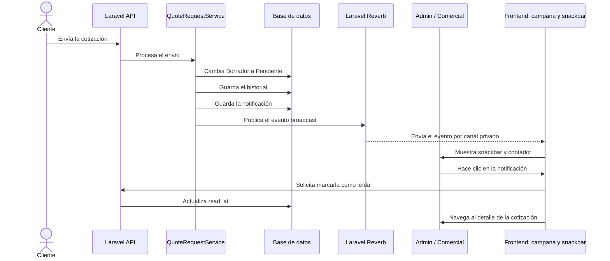
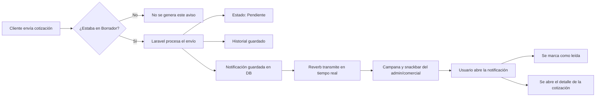

# Notificaciones de cotizaciones en tiempo real

La notificación se genera únicamente cuando el cliente envía una cotización que estaba en estado `Borrador`. El estado cambia a `Pendiente` y, desde ese momento, los usuarios administrativos reciben el aviso.



## Lectura rápida del flujo



## Componentes y responsabilidades

| Componente | Responsabilidad |
|---|---|
| Cliente | Envía una cotización guardada como borrador. |
| `QuoteRequestService` | Cambia el estado, guarda el historial y dispara la notificación. |
| Laravel Notification | Construye el mensaje y sus datos. |
| Tabla `notifications` | Conserva el aviso aunque el destinatario no esté conectado. |
| Laravel Reverb | Transmite el evento en tiempo real. |
| Laravel Echo | Escucha el canal privado del usuario en el frontend. |
| Campana y snackbar | Muestran el aviso y permiten abrir la cotización. |

## Información enviada

La notificación incluye:

- Tipo: `quote_submitted`.
- Título: `Nueva cotización pendiente`.
- Mensaje con el número de cotización.
- ID de la cotización para construir el enlace.
- Número de solicitud para mostrarlo al usuario.

## Seguridad y comportamiento

- Los eventos se envían por un canal privado asociado al usuario.
- Solo reciben la notificación los usuarios administrativos autorizados.
- La notificación se guarda antes de depender de la conexión WebSocket.
- Si el usuario estaba desconectado, puede verla al abrir la campanita.
- El frontend marca el registro como leído mediante la API.

## Servidores locales

```powershell
php artisan serve
php artisan reverb:start --host=127.0.0.1 --port=8080
pnpm dev
```
