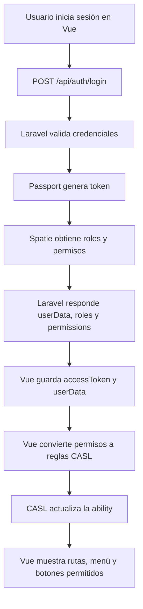
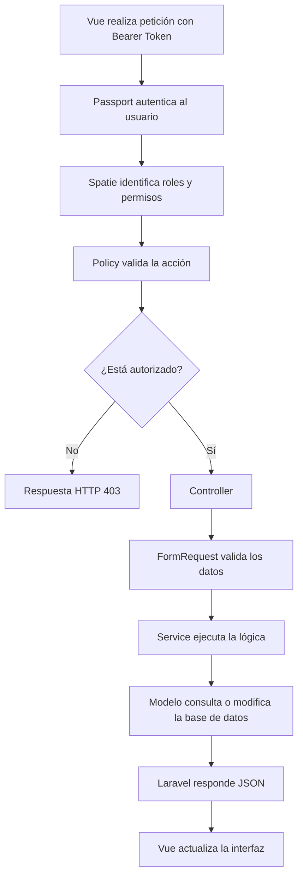

# Flujo Backend y Frontend

## 1. Flujo General



## 2. Flujo de una petición protegida



## 3. Roles actuales

| Rol | Acceso principal |
|---|---|
| `admin` | Consulta todas las cotizaciones y empresas |
| `commercial` | Consulta todas las cotizaciones y empresas |
| `customer` | Consulta sus cotizaciones y gestiona su empresa |

### Empresas

- `admin`: solo consulta empresas.
- `commercial`: solo consulta empresas.
- `customer` sin empresa: puede crear su empresa.
- `customer` con empresa: puede ver y actualizar únicamente su empresa.

### Cotizaciones

- `admin`: puede consultar todas las cotizaciones.
- `commercial`: puede consultar todas las cotizaciones.
- `customer`: solo puede consultar las cotizaciones de su empresa.
- `customer`: puede crear y actualizar sus cotizaciones según su estado.

## 4. Flujo de empresas

```mermaid
flowchart TD
    A[Customer inicia sesión] --> B{¿Tiene customer_id?}
    B -- No --> C[Vue muestra formulario de empresa]
    C --> D[POST /api/customers]
    D --> E[CustomerPolicy create]
    E --> F[Empresa creada]
    F --> G[Laravel asigna customer_id al usuario]
    B -- Sí --> H[Vue carga los datos de su empresa]
    H --> I[PUT /api/customers/{id}]
    I --> J[CustomerPolicy update]
    J --> K[Empresa actualizada]
```

Para `admin` y `commercial`, la vista muestra únicamente el listado de empresas en modo lectura.

## 5. Flujo de cotizaciones

```mermaid
flowchart TD
    A[Usuario abre cotizaciones] --> B[GET /api/quote-requests]
    B --> C[QuoteRequestPolicy viewAny]
    C --> D{¿Qué rol tiene?}
    D -- Admin o Commercial --> E[Laravel devuelve todas las cotizaciones]
    D -- Customer --> F[Laravel filtra por customer_id]
    E --> G[Vue muestra el listado]
    F --> G
    G --> H[Usuario abre una cotización]
    H --> I[GET /api/quote-requests/{id}]
    I --> J[QuoteRequestPolicy view]
```

## 6. Control de acceso en Materialize Vue

El frontend usa CASL, siguiendo la arquitectura de Materialize Vue.

Las reglas del backend se convierten a reglas CASL:

```ts
{
  action: "read",
  subject: "QuoteRequest"
}
```

Ejemplo de metadata de una página:

```ts
definePage({
  meta: {
    action: "read",
    subject: "QuoteRequest",
  },
})
```

Ejemplo de protección de un botón:

```ts
const canUpdateQuote = computed(() =>
  ability.can("update", "QuoteRequest"),
)
```

El backend sigue siendo la autoridad real. CASL únicamente controla la experiencia visual y la navegación del frontend.

## 7. Archivos principales

### Backend

- `app/Policies/QuoteRequestPolicy.php`
- `app/Policies/CustomerPolicy.php`
- `app/Http/Controllers/Commercial/QuoteController.php`
- `app/Http/Controllers/CustomerController.php`
- `app/Services/Commercial/QuoteRequestService.php`
- `app/Http/Requests/Commercial/QuoteRequestFormRequest.php`
- `app/Http/Requests/Customer/CRequest.php`
- `database/seeders/RoleAndUserSeeder.php`
- `database/seeders/QuoteRequestSeeder.php`

### Frontend

- `src/plugins/casl/ability.ts`
- `src/plugins/casl/permissions.ts`
- `src/plugins/casl/composables/useAbility.ts`
- `src/plugins/1.router/index.ts`
- `src/navigation/vertical/index.ts`
- `src/pages/index.vue`
- `src/pages/customer/index.vue`
- `src/pages/quotations/list/index.vue`
- `src/pages/quotations/[id]/index.vue`

## 8. Próximas etapas

1. Crear un dashboard real para `admin`.
2. Crear un dashboard real para `commercial`.
3. Mejorar el listado comercial de cotizaciones.
4. Agregar cambio de estado de cotizaciones.
5. Mostrar timeline e historial de cambios.
6. Crear CRUD de usuarios.
7. Crear CRUD de roles.
8. Permitir asignar roles a usuarios.
9. Permitir asignar permisos a roles.
10. Agregar tests para cada módulo.

## 9. Validación actual

La suite actual del backend cubre:

- Autenticación y permisos.
- Policies de cotizaciones.
- Policies de empresas.
- Visibilidad por empresa.
- Seeders de usuarios, empresas y cotizaciones.
- Controllers de cotizaciones.

El frontend mantiene un error externo pendiente relacionado con la dependencia `@iconify/types`.
